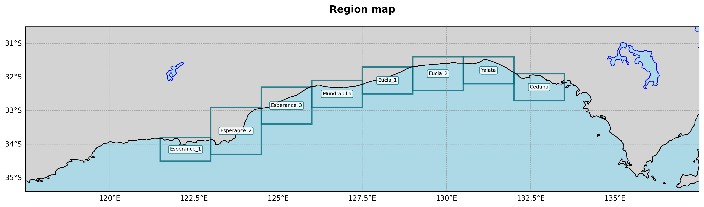
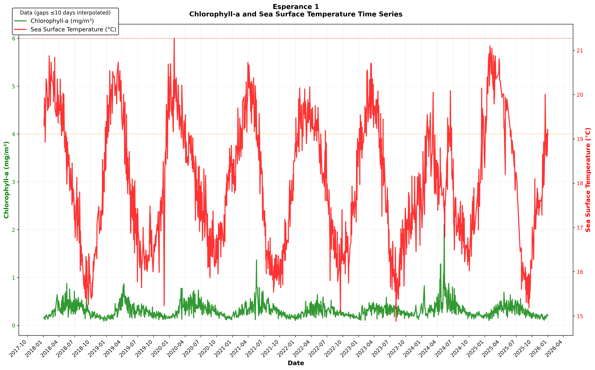
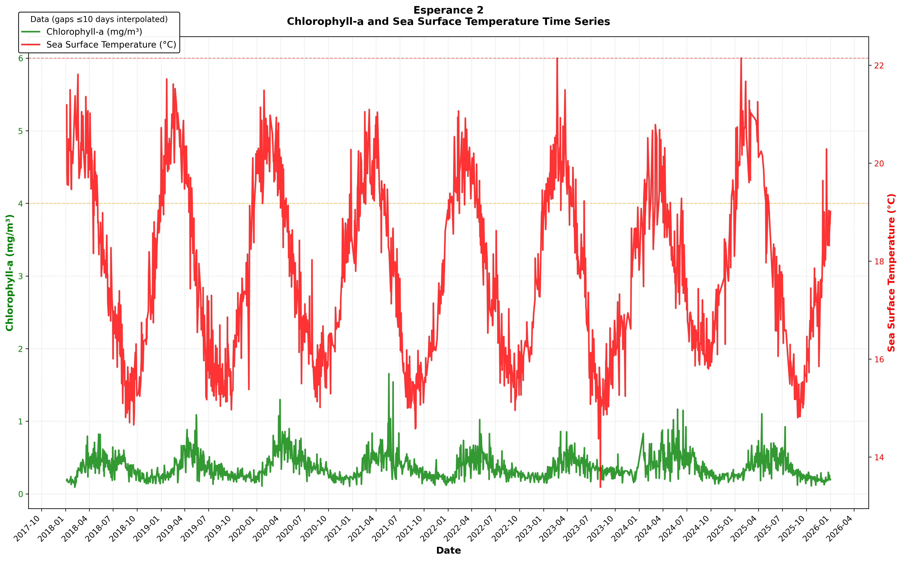
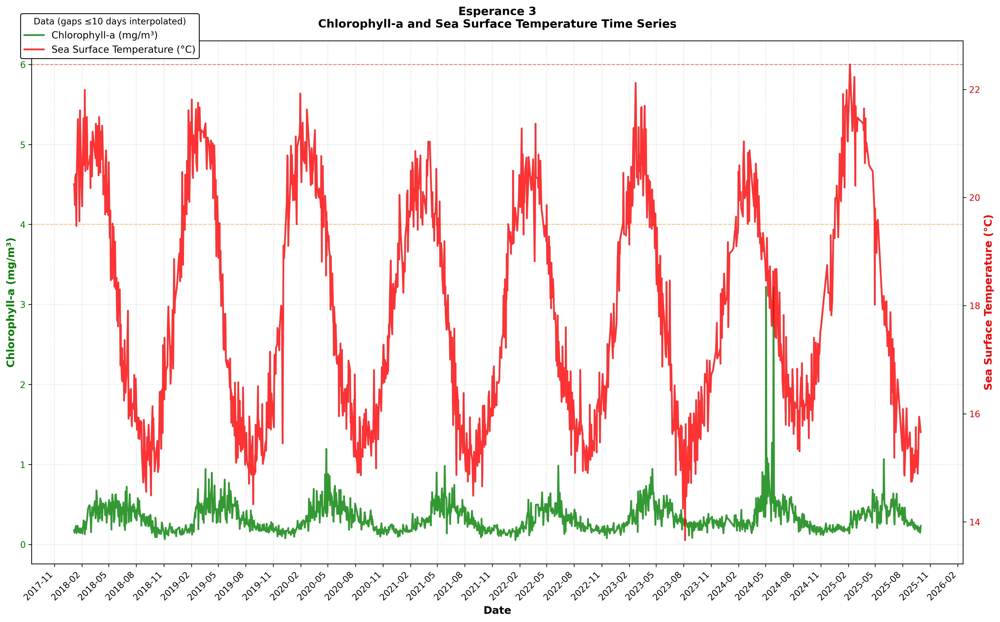
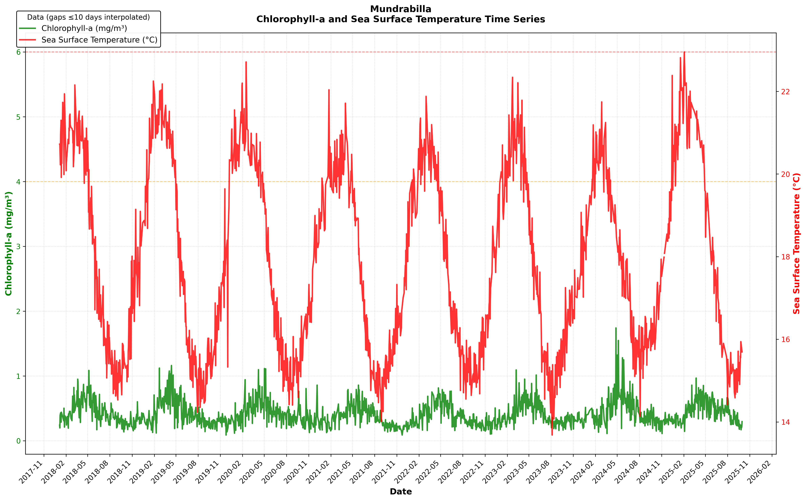
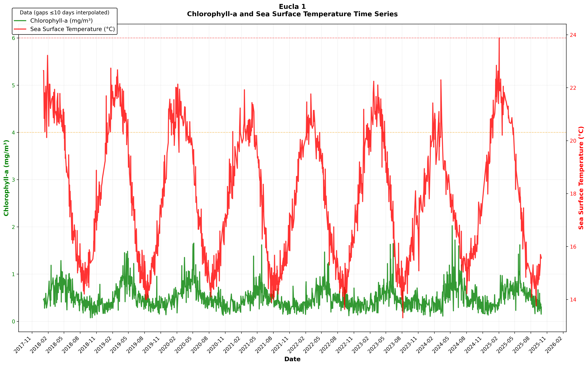
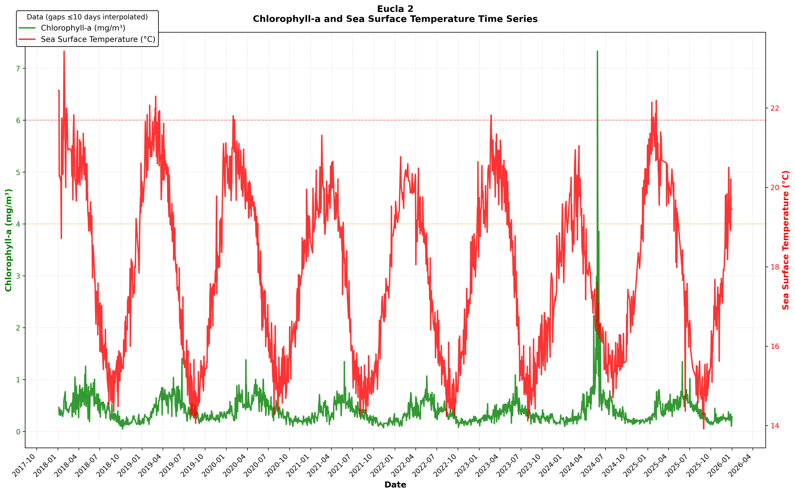
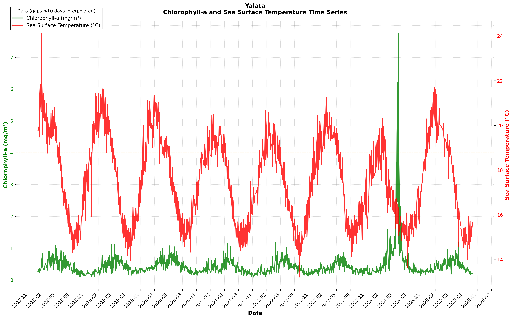
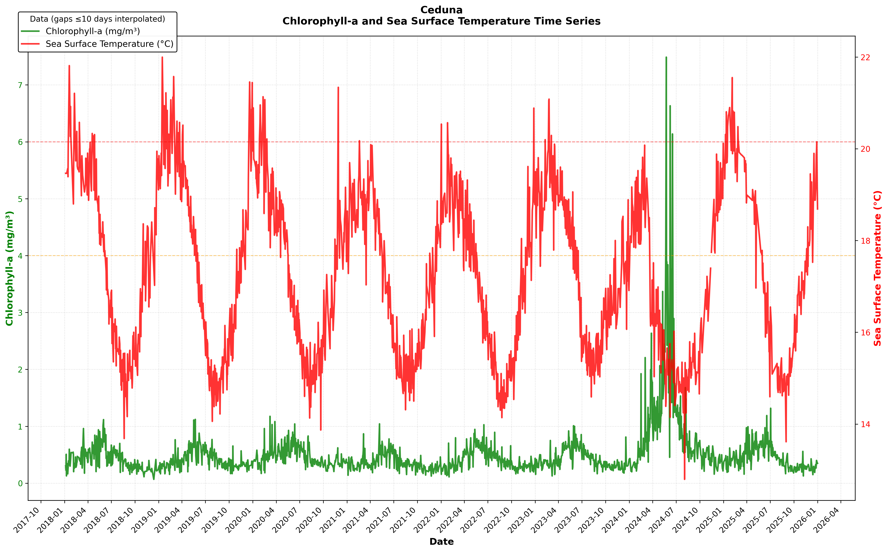

## South Australian algal bloom investigation









### Yearly mean values
```
| Group      |   Esperance_1 |   Esperance_2 |   Esperance_3 |   Mundrabilla |   Eucla_1 |   Eucla_2 |   Yalata |   Ceduna |
|:-----------|--------------:|--------------:|--------------:|--------------:|----------:|----------:|---------:|---------:|
| 2018       |      0.299269 |      0.331564 |      0.301893 |      0.396304 |  0.463083 |  0.380462 | 0.380931 | 0.393414 |
| 2019       |      0.274667 |      0.333007 |      0.295841 |      0.379872 |  0.484944 |  0.388647 | 0.386734 | 0.391835 |
| 2020       |      0.3057   |      0.374368 |      0.309326 |      0.406663 |  0.515832 |  0.394108 | 0.429601 | 0.454665 |
| 2021       |      0.300801 |      0.358507 |      0.278044 |      0.337301 |  0.433598 |  0.326163 | 0.340813 | 0.345468 |
| 2022       |      0.267139 |      0.332516 |      0.268757 |      0.354889 |  0.448399 |  0.329405 | 0.364772 | 0.390943 |
| 2023       |      0.287599 |      0.34534  |      0.327493 |      0.384562 |  0.433107 |  0.330418 | 0.371012 | 0.405244 |
| 2024Q1     |      0.325569 |      0.442363 |      0.263215 |      0.369742 |  0.342068 |  0.267744 | 0.444184 | 0.631265 |
| 2024Q2     |      0.517243 |      0.47551  |      0.53441  |      0.641269 |  0.710943 |  0.782537 | 1.17761  | 1.7111   |
| 2024Q3     |      0.327558 |      0.37114  |      0.325901 |      0.388948 |  0.519596 |  0.394554 | 0.429522 | 0.746391 |
| 2024Q4     |      0.211122 |      0.230412 |      0.189309 |      0.28372  |  0.297358 |  0.197346 | 0.26424  | 0.405632 |
| 2025Q1     |      0.261775 |      0.343117 |      0.281498 |      0.436463 |  0.528841 |  0.39293  | 0.383236 | 0.410759 |
| 2025Q2     |      0.380522 |      0.463449 |      0.42758  |      0.538931 |  0.712664 |  0.570472 | 0.580635 | 0.64056  |
| 2025Q3     |      0.29624  |      0.309776 |      0.296507 |      0.356496 |  0.417379 |  0.337753 | 0.341371 | 0.382981 |
| 2025Q4     |      0.186172 |      0.206876 |      0.159577 |      0.237124 |  0.319698 |  0.222113 | 0.303169 | 0.274226 |
| 2026Q1     |      0.218852 |      0.209078 |      0.173456 |      0.287813 |  0.436774 |  0.343263 | 0.472058 | 0.368263 |
| Grand Mean |      0.288853 |      0.331862 |      0.282407 |      0.375856 |  0.457498 |  0.356978 | 0.415277 | 0.471778 |
```

## VIIRS Pixel Coverage Summary
```

Esperance_1 {'lat_km': 77.9240000000003, 'lon_km': 138.1877671018132, 'area_km2': 10768.143563641734, 'expected_pixels': 673.0089727276084}
Esperance_2 {'lat_km': 155.84799999999984, 'lon_km': 139.0811887737724, 'area_km2': 21675.52510801486, 'expected_pixels': 1354.7203192509287}
Esperance_3 {'lat_km': 122.45200000000015, 'lon_km': 140.27882163004534, 'area_km2': 17177.422266242334, 'expected_pixels': 1073.588891640146}
Mundrabilla {'lat_km': 89.05599999999968, 'lon_km': 140.82950362183564, 'area_km2': 12541.712274546151, 'expected_pixels': 783.8570171591344}
Eucla_1 {'lat_km': 89.05600000000007, 'lon_km': 141.45241843238927, 'area_km2': 12597.186575914868, 'expected_pixels': 787.3241609946792}
Eucla_2 {'lat_km': 111.32, 'lon_km': 141.76129240031406, 'area_km2': 15780.86707000296, 'expected_pixels': 986.304191875185}
Yalata {'lat_km': 89.05600000000047, 'lon_km': 141.91508187494654, 'area_km2': 12638.389531455305, 'expected_pixels': 789.8993457159565}
Ceduna {'lat_km': 89.05600000000047, 'lon_km': 141.14182091138554, 'area_km2': 12569.526003084417, 'expected_pixels': 785.595375192776}

```


---
## Ocean temperature analysis

- Water depth measured: 10.0 m
- Sampling area per cell: 0.5625 km²
- Reference temperature: 15.0°C

### Esperance_1

- **Average temperature:** 18.0°C (range 14.9–21.3°C)
- **Cooling trend:** -0.057°C per year (±0.032°C) — statistically reliable
- **Days warmer than normal per year:** 539 &nbsp; **Cooler than normal:** 0

**8 heat waves detected (73 days total)** — unusually warm threshold: above 19.9°C

  - Feb 12 2018 – Feb 28 2018: **6 days** · avg 20.4°C (+0.5°C above threshold) · peak 20.7°C (+0.9°C)
  - Mar 2 2018 – Mar 8 2018: **5 days** · avg 20.3°C (+0.4°C above threshold) · peak 20.8°C (+1.0°C)
  - Feb 7 2019 – Feb 27 2019: **10 days** · avg 20.3°C (+0.4°C above threshold) · peak 20.5°C (+0.6°C)
  - Mar 3 2019 – Mar 21 2019: **7 days** · avg 20.4°C (+0.5°C above threshold) · peak 20.7°C (+0.9°C)
  - Jan 28 2020 – Feb 8 2020: **5 days** · avg 20.5°C (+0.6°C above threshold) · peak 21.3°C (+1.4°C)
  - Mar 31 2021 – Apr 15 2021: **6 days** · avg 20.3°C (+0.5°C above threshold) · peak 20.7°C (+0.9°C)
  - Jan 13 2025 – Feb 21 2025: **19 days** · avg 20.5°C (+0.6°C above threshold) · peak 21.1°C (+1.2°C)
  - Feb 25 2025 – Apr 21 2025: **15 days** · avg 20.4°C (+0.6°C above threshold) · peak 20.9°C (+1.0°C)

### Esperance_2

- **Average temperature:** 17.7°C (range 13.4–22.1°C)
- **Cooling trend:** -0.065°C per year (±0.038°C) — statistically reliable
- **Days warmer than normal per year:** 524 &nbsp; **Cooler than normal:** 1

**6 heat waves detected (50 days total)** — unusually warm threshold: above 20.2°C

  - Feb 6 2018 – Feb 19 2018: **9 days** · avg 21.0°C (+0.8°C above threshold) · peak 21.8°C (+1.6°C)
  - Mar 2 2018 – Mar 10 2018: **6 days** · avg 20.6°C (+0.4°C above threshold) · peak 21.1°C (+0.9°C)
  - Mar 18 2018 – Mar 27 2018: **5 days** · avg 20.8°C (+0.6°C above threshold) · peak 21.4°C (+1.2°C)
  - Feb 21 2019 – Mar 16 2019: **12 days** · avg 20.7°C (+0.6°C above threshold) · peak 21.5°C (+1.4°C)
  - Jan 29 2025 – Feb 15 2025: **10 days** · avg 20.8°C (+0.6°C above threshold) · peak 21.7°C (+1.5°C)
  - Mar 2 2025 – Mar 29 2025: **8 days** · avg 20.8°C (+0.7°C above threshold) · peak 21.3°C (+1.1°C)

### Esperance_3

- **Average temperature:** 17.7°C (range 13.7–22.5°C)
- **Cooling trend:** -0.067°C per year (±0.043°C) — statistically reliable
- **Days warmer than normal per year:** 538 &nbsp; **Cooler than normal:** 1

**9 heat waves detected (73 days total)** — unusually warm threshold: above 20.6°C

  - Feb 13 2018 – Feb 18 2018: **5 days** · avg 21.1°C (+0.5°C above threshold) · peak 21.5°C (+0.9°C)
  - Mar 7 2018 – Mar 27 2018: **7 days** · avg 21.0°C (+0.5°C above threshold) · peak 21.4°C (+0.8°C)
  - Apr 4 2018 – Apr 12 2018: **6 days** · avg 21.0°C (+0.5°C above threshold) · peak 21.3°C (+0.7°C)
  - Feb 7 2019 – Feb 17 2019: **5 days** · avg 21.0°C (+0.5°C above threshold) · peak 21.6°C (+1.1°C)
  - Feb 21 2019 – Mar 20 2019: **12 days** · avg 21.3°C (+0.7°C above threshold) · peak 21.8°C (+1.2°C)
  - Apr 7 2019 – Apr 13 2019: **5 days** · avg 20.9°C (+0.3°C above threshold) · peak 21.1°C (+0.5°C)
  - Feb 4 2020 – Feb 15 2020: **7 days** · avg 20.9°C (+0.4°C above threshold) · peak 21.4°C (+0.8°C)
  - Jan 21 2025 – Feb 22 2025: **14 days** · avg 21.6°C (+1.1°C above threshold) · peak 22.5°C (+1.9°C)
  - Feb 25 2025 – Apr 11 2025: **12 days** · avg 21.2°C (+0.6°C above threshold) · peak 21.7°C (+1.1°C)

### Mundrabilla

- **Average temperature:** 17.8°C (range 13.7–23.0°C)
- **Cooling trend:** -0.066°C per year (±0.048°C) — statistically reliable
- **Days warmer than normal per year:** 536 &nbsp; **Cooler than normal:** 4

**6 heat waves detected (68 days total)** — unusually warm threshold: above 20.8°C

  - Feb 13 2018 – Feb 28 2018: **6 days** · avg 21.2°C (+0.4°C above threshold) · peak 21.4°C (+0.6°C)
  - Jan 21 2019 – Mar 3 2019: **21 days** · avg 21.4°C (+0.6°C above threshold) · peak 22.2°C (+1.4°C)
  - Mar 5 2019 – Mar 20 2019: **6 days** · avg 21.5°C (+0.7°C above threshold) · peak 22.2°C (+1.4°C)
  - Jan 26 2020 – Feb 2 2020: **6 days** · avg 21.6°C (+0.7°C above threshold) · peak 22.2°C (+1.4°C)
  - Jan 10 2025 – Feb 11 2025: **16 days** · avg 21.9°C (+1.1°C above threshold) · peak 23.0°C (+2.1°C)
  - Feb 25 2025 – Apr 2 2025: **13 days** · avg 21.4°C (+0.6°C above threshold) · peak 22.0°C (+1.2°C)

### Eucla_1

- **Average temperature:** 17.7°C (range 13.3–23.9°C)
- **Cooling trend:** -0.115°C per year (±0.053°C) — statistically reliable
- **Days warmer than normal per year:** 500 &nbsp; **Cooler than normal:** 10

**7 heat waves detected (75 days total)** — unusually warm threshold: above 21.0°C

  - Feb 7 2018 – Feb 28 2018: **8 days** · avg 21.5°C (+0.5°C above threshold) · peak 22.1°C (+1.1°C)
  - Jan 26 2019 – Mar 20 2019: **26 days** · avg 21.8°C (+0.8°C above threshold) · peak 22.7°C (+1.7°C)
  - Jan 26 2020 – Jan 31 2020: **5 days** · avg 21.7°C (+0.7°C above threshold) · peak 22.0°C (+1.0°C)
  - Feb 19 2023 – Mar 4 2023: **6 days** · avg 21.5°C (+0.5°C above threshold) · peak 22.2°C (+1.2°C)
  - Mar 15 2023 – Mar 28 2023: **6 days** · avg 21.4°C (+0.4°C above threshold) · peak 22.1°C (+1.1°C)
  - Jan 9 2025 – Feb 17 2025: **18 days** · avg 22.0°C (+1.0°C above threshold) · peak 23.9°C (+2.9°C)
  - Feb 26 2025 – Mar 26 2025: **6 days** · avg 21.5°C (+0.6°C above threshold) · peak 22.1°C (+1.1°C)

### Eucla_2

- **Average temperature:** 17.7°C (range 13.9–23.4°C)
- **Cooling trend:** -0.127°C per year (±0.045°C) — statistically reliable
- **Days warmer than normal per year:** 542 &nbsp; **Cooler than normal:** 6

**5 heat waves detected (74 days total)** — unusually warm threshold: above 20.6°C

  - Feb 5 2018 – Mar 1 2018: **11 days** · avg 21.2°C (+0.7°C above threshold) · peak 22.0°C (+1.4°C)
  - Jan 27 2019 – Mar 14 2019: **25 days** · avg 21.3°C (+0.8°C above threshold) · peak 22.3°C (+1.7°C)
  - Jan 26 2020 – Feb 10 2020: **10 days** · avg 21.2°C (+0.6°C above threshold) · peak 21.8°C (+1.3°C)
  - Jan 6 2025 – Feb 14 2025: **23 days** · avg 21.2°C (+0.6°C above threshold) · peak 22.2°C (+1.6°C)
  - Feb 26 2025 – Mar 23 2025: **5 days** · avg 21.0°C (+0.5°C above threshold) · peak 21.4°C (+0.8°C)

### Yalata

- **Average temperature:** 17.5°C (range 13.2–24.1°C)
- **Cooling trend:** -0.125°C per year (±0.041°C) — statistically reliable
- **Days warmer than normal per year:** 499 &nbsp; **Cooler than normal:** 6

**10 heat waves detected (92 days total)** — unusually warm threshold: above 20.0°C

  - Jan 17 2018 – Jan 28 2018: **7 days** · avg 21.6°C (+1.6°C above threshold) · peak 24.1°C (+4.1°C)
  - Feb 5 2018 – Feb 27 2018: **11 days** · avg 20.7°C (+0.7°C above threshold) · peak 21.4°C (+1.4°C)
  - Apr 18 2018 – Apr 24 2018: **5 days** · avg 20.4°C (+0.4°C above threshold) · peak 20.8°C (+0.8°C)
  - Feb 7 2019 – Mar 10 2019: **19 days** · avg 20.8°C (+0.8°C above threshold) · peak 21.6°C (+1.6°C)
  - Mar 16 2019 – Mar 21 2019: **5 days** · avg 20.4°C (+0.4°C above threshold) · peak 21.2°C (+1.2°C)
  - Dec 28 2019 – Jan 5 2020: **7 days** · avg 20.6°C (+0.6°C above threshold) · peak 21.1°C (+1.1°C)
  - Jan 29 2020 – Feb 17 2020: **11 days** · avg 20.7°C (+0.7°C above threshold) · peak 21.4°C (+1.4°C)
  - Feb 22 2020 – Mar 4 2020: **5 days** · avg 20.5°C (+0.5°C above threshold) · peak 21.0°C (+1.0°C)
  - Feb 18 2023 – Feb 25 2023: **6 days** · avg 20.7°C (+0.7°C above threshold) · peak 21.2°C (+1.3°C)
  - Jan 16 2025 – Feb 7 2025: **16 days** · avg 20.8°C (+0.8°C above threshold) · peak 21.7°C (+1.7°C)

### Ceduna

- **Average temperature:** 17.3°C (range 12.8–22.0°C)
- **Cooling trend:** -0.108°C per year (±0.038°C) — statistically reliable
- **Days warmer than normal per year:** 468 &nbsp; **Cooler than normal:** 6

**10 heat waves detected (83 days total)** — unusually warm threshold: above 19.7°C

  - Jan 15 2018 – Jan 25 2018: **6 days** · avg 20.8°C (+1.1°C above threshold) · peak 21.8°C (+2.1°C)
  - Feb 8 2018 – Feb 17 2018: **6 days** · avg 20.3°C (+0.6°C above threshold) · peak 21.2°C (+1.5°C)
  - Apr 18 2018 – Apr 24 2018: **5 days** · avg 20.2°C (+0.5°C above threshold) · peak 20.3°C (+0.6°C)
  - Jan 27 2019 – Feb 3 2019: **6 days** · avg 20.4°C (+0.7°C above threshold) · peak 21.2°C (+1.5°C)
  - Feb 14 2019 – Mar 4 2019: **12 days** · avg 20.7°C (+1.0°C above threshold) · peak 21.6°C (+1.9°C)
  - Dec 17 2019 – Dec 24 2019: **5 days** · avg 20.5°C (+0.8°C above threshold) · peak 21.5°C (+1.8°C)
  - Dec 27 2019 – Jan 8 2020: **9 days** · avg 20.4°C (+0.7°C above threshold) · peak 21.4°C (+1.8°C)
  - Feb 5 2020 – Feb 12 2020: **5 days** · avg 20.5°C (+0.8°C above threshold) · peak 21.1°C (+1.4°C)
  - Feb 18 2023 – Feb 25 2023: **7 days** · avg 20.4°C (+0.7°C above threshold) · peak 21.1°C (+1.4°C)
  - Jan 9 2025 – Feb 12 2025: **22 days** · avg 20.4°C (+0.7°C above threshold) · peak 21.6°C (+1.9°C)

---

Last updated: Sun 17 May 2026 17:21:07 ACST
