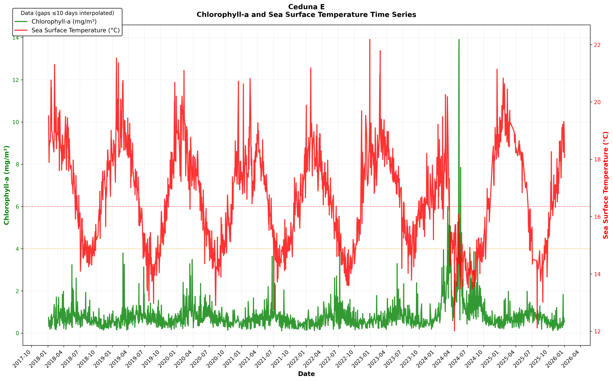
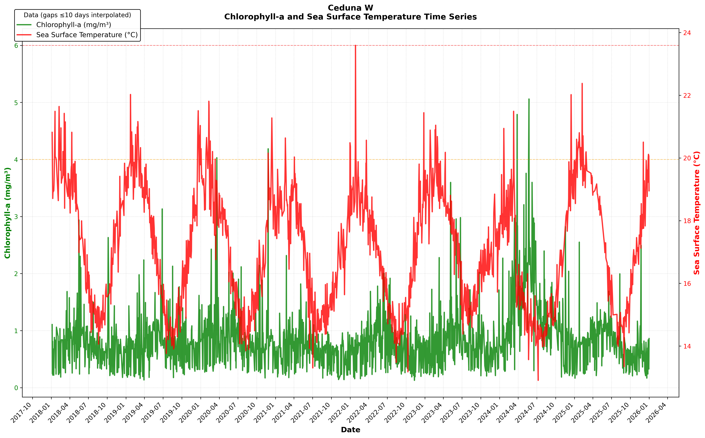
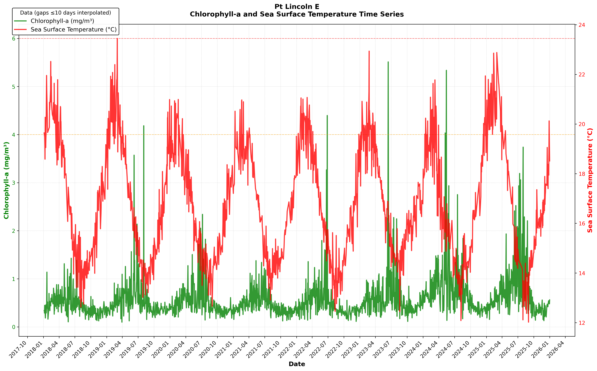
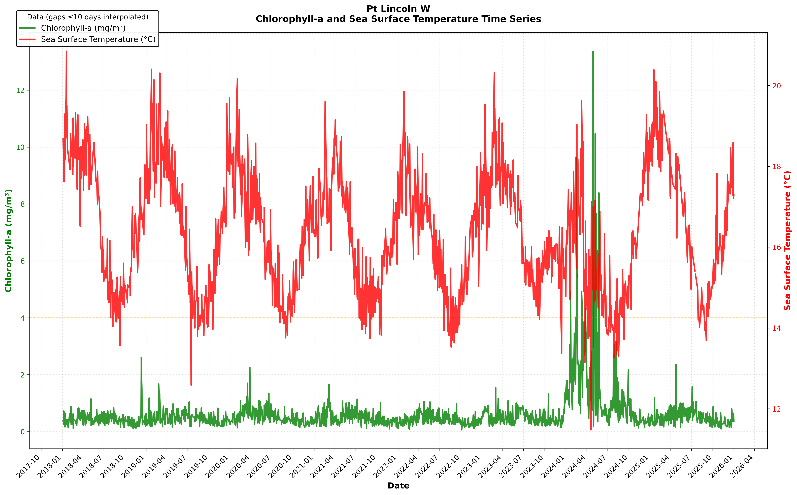
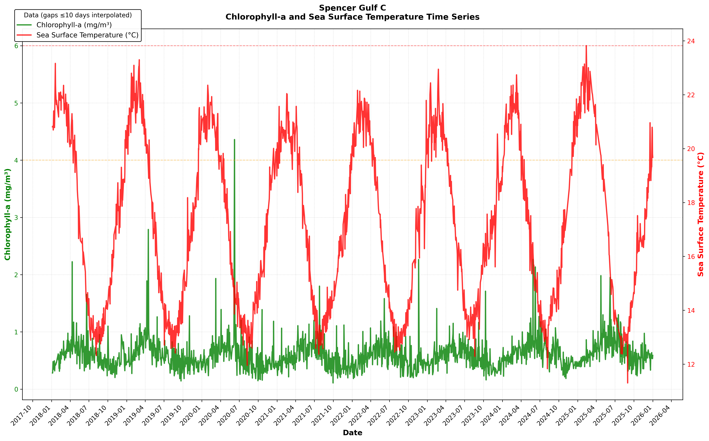
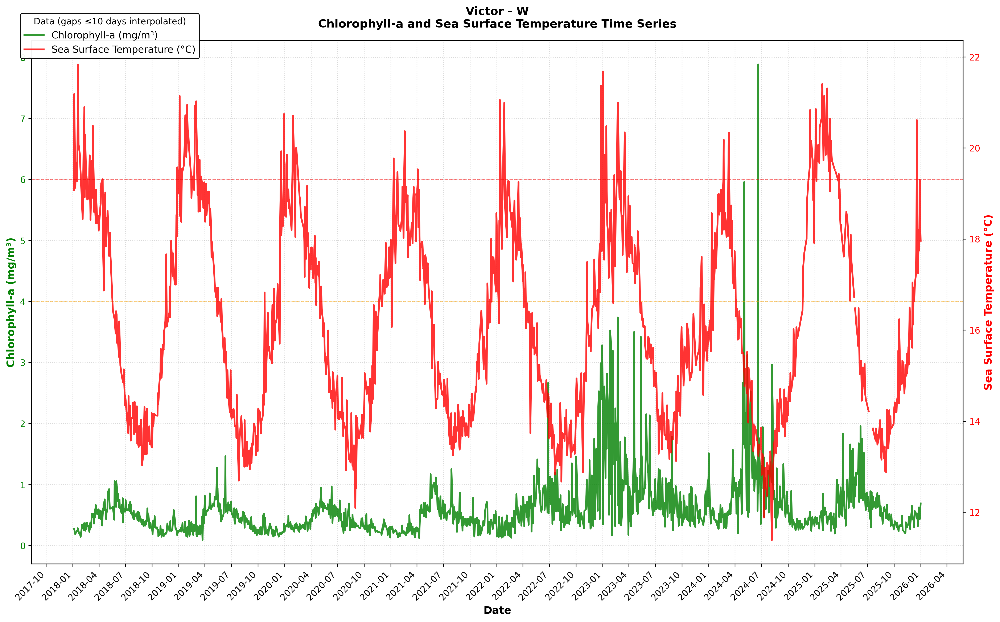
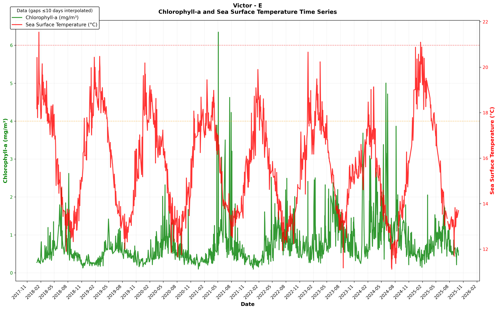
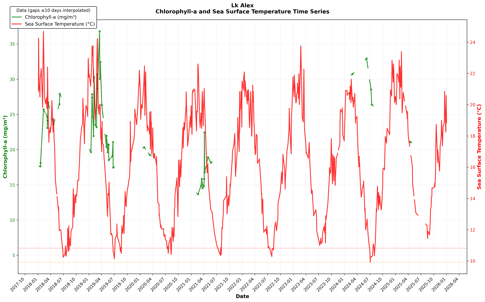
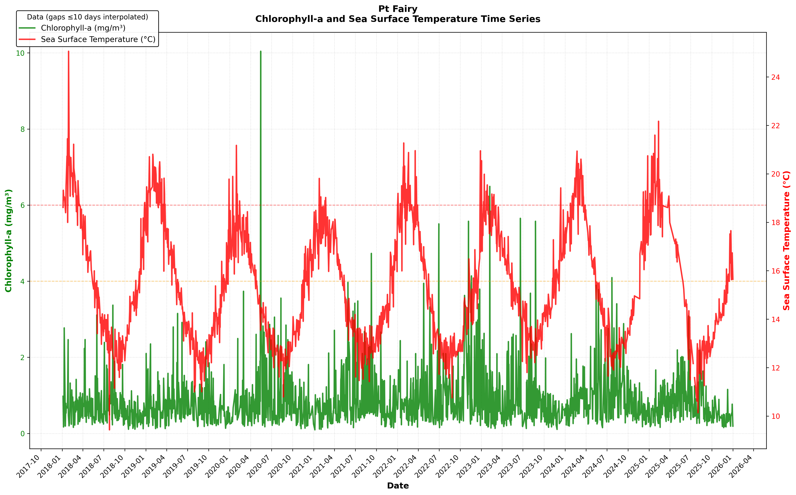

## South Australian algal bloom investigation with VIIRS SST and Chlr-A data
















## Ocean temperature analysis

- Water depth measured: 10.0 m
- Sampling area per cell: 0.5625 km²
- Reference temperature: 15.0°C

### GAB

- **Average temperature:** 17.5°C (range 13.2–24.1°C)
- **Cooling trend:** -0.121°C per year (±0.038°C) — statistically reliable
- **Days warmer than normal per year:** 564 &nbsp; **Cooler than normal:** 6

**9 heat waves detected (88 days total)** — unusually warm threshold: above 20.0°C

  - Jan 17 2018 – Jan 28 2018: **7 days** · avg 21.6°C (+1.6°C above threshold) · peak 24.1°C (+4.1°C)
  - Feb 5 2018 – Feb 27 2018: **12 days** · avg 20.7°C (+0.6°C above threshold) · peak 21.5°C (+1.4°C)
  - Apr 16 2018 – Apr 21 2018: **5 days** · avg 20.4°C (+0.4°C above threshold) · peak 20.7°C (+0.7°C)
  - Feb 7 2019 – Mar 13 2019: **21 days** · avg 20.9°C (+0.8°C above threshold) · peak 21.8°C (+1.8°C)
  - Mar 16 2019 – Mar 21 2019: **5 days** · avg 20.4°C (+0.4°C above threshold) · peak 21.2°C (+1.2°C)
  - Jan 26 2020 – Feb 10 2020: **10 days** · avg 20.8°C (+0.8°C above threshold) · peak 21.5°C (+1.4°C)
  - Feb 18 2023 – Feb 25 2023: **7 days** · avg 20.7°C (+0.6°C above threshold) · peak 21.3°C (+1.3°C)
  - Jan 9 2025 – Jan 14 2025: **5 days** · avg 20.7°C (+0.7°C above threshold) · peak 21.3°C (+1.3°C)
  - Jan 16 2025 – Feb 7 2025: **16 days** · avg 20.8°C (+0.8°C above threshold) · peak 21.9°C (+1.8°C)

### Ceduna W

- **Average temperature:** 17.1°C (range 12.9–23.6°C)
- **Cooling trend:** -0.086°C per year (±0.042°C) — statistically reliable
- **Days warmer than normal per year:** 403 &nbsp; **Cooler than normal:** 14

**9 heat waves detected (61 days total)** — unusually warm threshold: above 19.5°C

  - Jan 18 2018 – Jan 25 2018: **5 days** · avg 20.5°C (+1.0°C above threshold) · peak 21.5°C (+2.0°C)
  - Feb 6 2018 – Feb 17 2018: **6 days** · avg 20.4°C (+0.9°C above threshold) · peak 21.6°C (+2.1°C)
  - Jan 27 2019 – Feb 3 2019: **6 days** · avg 20.1°C (+0.6°C above threshold) · peak 20.8°C (+1.3°C)
  - Feb 23 2019 – Mar 1 2019: **6 days** · avg 20.6°C (+1.1°C above threshold) · peak 21.2°C (+1.7°C)
  - Dec 28 2019 – Jan 3 2020: **5 days** · avg 20.5°C (+1.0°C above threshold) · peak 21.0°C (+1.5°C)
  - Jan 27 2020 – Feb 12 2020: **9 days** · avg 20.5°C (+1.0°C above threshold) · peak 21.8°C (+2.3°C)
  - Feb 19 2023 – Feb 25 2023: **6 days** · avg 20.4°C (+0.9°C above threshold) · peak 21.0°C (+1.5°C)
  - Jan 9 2025 – Jan 14 2025: **5 days** · avg 19.9°C (+0.4°C above threshold) · peak 20.6°C (+1.1°C)
  - Jan 16 2025 – Feb 8 2025: **13 days** · avg 20.3°C (+0.8°C above threshold) · peak 22.4°C (+2.9°C)

### Ceduna E

- **Average temperature:** 16.6°C (range 12.0–22.2°C)
- **Cooling trend:** -0.097°C per year (±0.036°C) — statistically reliable
- **Days warmer than normal per year:** 362 &nbsp; **Cooler than normal:** 27

**10 heat waves detected (71 days total)** — unusually warm threshold: above 18.8°C

  - Jan 18 2018 – Jan 25 2018: **6 days** · avg 19.8°C (+0.9°C above threshold) · peak 20.8°C (+1.9°C)
  - Feb 6 2018 – Feb 15 2018: **5 days** · avg 19.5°C (+0.7°C above threshold) · peak 21.3°C (+2.5°C)
  - Apr 19 2018 – Apr 24 2018: **5 days** · avg 19.1°C (+0.3°C above threshold) · peak 19.4°C (+0.6°C)
  - Jan 22 2019 – Feb 4 2019: **11 days** · avg 19.9°C (+1.0°C above threshold) · peak 21.5°C (+2.7°C)
  - Feb 23 2019 – Mar 5 2019: **8 days** · avg 19.9°C (+1.0°C above threshold) · peak 20.8°C (+1.9°C)
  - Feb 7 2020 – Feb 15 2020: **6 days** · avg 19.8°C (+1.0°C above threshold) · peak 21.1°C (+2.3°C)
  - Feb 20 2023 – Feb 25 2023: **5 days** · avg 20.4°C (+1.6°C above threshold) · peak 21.8°C (+2.9°C)
  - Jan 7 2025 – Jan 27 2025: **13 days** · avg 19.7°C (+0.9°C above threshold) · peak 20.8°C (+2.0°C)
  - Feb 1 2025 – Feb 8 2025: **6 days** · avg 19.1°C (+0.3°C above threshold) · peak 19.6°C (+0.7°C)
  - Feb 24 2025 – Mar 24 2025: **6 days** · avg 19.2°C (+0.4°C above threshold) · peak 19.7°C (+0.9°C)

### Pt Lincoln W

- **Average temperature:** 16.3°C (range 11.5–20.8°C)
- **Cooling trend:** -0.097°C per year (±0.033°C) — statistically reliable
- **Days warmer than normal per year:** 285 &nbsp; **Cooler than normal:** 25

**8 heat waves detected (58 days total)** — unusually warm threshold: above 18.4°C

  - Jan 16 2018 – Jan 21 2018: **5 days** · avg 19.6°C (+1.2°C above threshold) · peak 20.8°C (+2.4°C)
  - Apr 8 2018 – Apr 14 2018: **5 days** · avg 18.8°C (+0.4°C above threshold) · peak 19.1°C (+0.6°C)
  - Apr 17 2018 – Apr 24 2018: **7 days** · avg 18.8°C (+0.4°C above threshold) · peak 19.2°C (+0.8°C)
  - Jan 19 2019 – Jan 29 2019: **7 days** · avg 19.2°C (+0.8°C above threshold) · peak 20.4°C (+2.0°C)
  - Feb 23 2019 – Mar 2 2019: **6 days** · avg 19.4°C (+1.0°C above threshold) · peak 20.3°C (+1.9°C)
  - Apr 1 2021 – Apr 8 2021: **6 days** · avg 18.8°C (+0.3°C above threshold) · peak 19.1°C (+0.7°C)
  - Feb 15 2023 – Feb 26 2023: **9 days** · avg 19.2°C (+0.7°C above threshold) · peak 20.3°C (+1.9°C)
  - Jan 12 2025 – Feb 2 2025: **13 days** · avg 19.2°C (+0.7°C above threshold) · peak 20.4°C (+1.9°C)

### Pt Lincoln E

- **Average temperature:** 16.8°C (range 12.0–23.4°C)
- **Cooling trend:** -0.085°C per year (±0.050°C) — statistically reliable
- **Days warmer than normal per year:** 386 &nbsp; **Cooler than normal:** 46

**7 heat waves detected (56 days total)** — unusually warm threshold: above 20.0°C

  - Feb 5 2018 – Mar 10 2018: **16 days** · avg 20.8°C (+0.9°C above threshold) · peak 22.5°C (+2.6°C)
  - Apr 7 2018 – Apr 12 2018: **5 days** · avg 20.3°C (+0.4°C above threshold) · peak 20.7°C (+0.7°C)
  - Jan 22 2019 – Feb 4 2019: **11 days** · avg 20.9°C (+0.9°C above threshold) · peak 22.1°C (+2.1°C)
  - Feb 20 2019 – Mar 3 2019: **8 days** · avg 21.3°C (+1.4°C above threshold) · peak 23.4°C (+3.5°C)
  - Feb 7 2020 – Feb 18 2020: **5 days** · avg 20.4°C (+0.4°C above threshold) · peak 21.0°C (+1.0°C)
  - Feb 11 2025 – Feb 18 2025: **5 days** · avg 21.6°C (+1.6°C above threshold) · peak 22.9°C (+2.9°C)
  - Feb 22 2025 – Mar 23 2025: **6 days** · avg 21.0°C (+1.0°C above threshold) · peak 22.9°C (+2.9°C)

### Spencer Gulf N

- **Average temperature:** 17.7°C (range 10.3–25.6°C)
- **Cooling trend:** -0.012°C per year (±0.078°C) — not statistically reliable
- **Days warmer than normal per year:** 699 &nbsp; **Cooler than normal:** 114

**12 heat waves detected (90 days total)** — unusually warm threshold: above 22.6°C

  - Jan 19 2018 – Jan 26 2018: **5 days** · avg 24.0°C (+1.4°C above threshold) · peak 24.6°C (+2.0°C)
  - Feb 5 2018 – Feb 28 2018: **11 days** · avg 23.3°C (+0.7°C above threshold) · peak 25.6°C (+3.0°C)
  - Jan 14 2019 – Jan 30 2019: **7 days** · avg 23.6°C (+1.0°C above threshold) · peak 24.5°C (+1.9°C)
  - Feb 2 2019 – Feb 9 2019: **6 days** · avg 23.6°C (+1.0°C above threshold) · peak 24.3°C (+1.7°C)
  - Feb 24 2019 – Mar 3 2019: **7 days** · avg 23.9°C (+1.2°C above threshold) · peak 24.8°C (+2.2°C)
  - Jan 26 2022 – Feb 2 2022: **6 days** · avg 23.7°C (+1.1°C above threshold) · peak 24.3°C (+1.7°C)
  - Jan 12 2023 – Jan 20 2023: **6 days** · avg 23.1°C (+0.5°C above threshold) · peak 24.1°C (+1.4°C)
  - Feb 20 2023 – Feb 26 2023: **5 days** · avg 23.8°C (+1.2°C above threshold) · peak 24.7°C (+2.1°C)
  - Jan 12 2024 – Jan 25 2024: **6 days** · avg 23.3°C (+0.7°C above threshold) · peak 25.2°C (+2.6°C)
  - Feb 18 2024 – Mar 3 2024: **10 days** · avg 23.4°C (+0.8°C above threshold) · peak 24.0°C (+1.3°C)
  - Jan 10 2025 – Jan 29 2025: **13 days** · avg 23.6°C (+1.0°C above threshold) · peak 24.2°C (+1.6°C)
  - Feb 6 2025 – Feb 19 2025: **8 days** · avg 23.7°C (+1.1°C above threshold) · peak 24.8°C (+2.1°C)

### Spencer Gulf C

- **Average temperature:** 17.3°C (range 11.3–23.8°C)
- **Cooling trend:** -0.049°C per year (±0.067°C) — not statistically reliable
- **Days warmer than normal per year:** 519 &nbsp; **Cooler than normal:** 83

**9 heat waves detected (86 days total)** — unusually warm threshold: above 21.4°C

  - Jan 19 2018 – Jan 25 2018: **5 days** · avg 22.2°C (+0.9°C above threshold) · peak 23.2°C (+1.8°C)
  - Feb 5 2018 – Feb 28 2018: **10 days** · avg 22.0°C (+0.6°C above threshold) · peak 22.3°C (+1.0°C)
  - Mar 4 2018 – Mar 10 2018: **5 days** · avg 21.7°C (+0.3°C above threshold) · peak 22.0°C (+0.7°C)
  - Jan 22 2019 – Feb 12 2019: **15 days** · avg 22.1°C (+0.7°C above threshold) · peak 23.1°C (+1.7°C)
  - Feb 20 2019 – Mar 13 2019: **13 days** · avg 22.2°C (+0.8°C above threshold) · peak 23.3°C (+1.9°C)
  - Feb 20 2023 – Feb 26 2023: **5 days** · avg 22.2°C (+0.9°C above threshold) · peak 22.9°C (+1.6°C)
  - Feb 8 2024 – Feb 13 2024: **5 days** · avg 21.9°C (+0.5°C above threshold) · peak 22.3°C (+1.0°C)
  - Jan 16 2025 – Feb 3 2025: **12 days** · avg 22.4°C (+1.0°C above threshold) · peak 23.1°C (+1.8°C)
  - Feb 6 2025 – Mar 2 2025: **16 days** · avg 22.3°C (+1.0°C above threshold) · peak 23.8°C (+2.5°C)

### Spencer Gulf S

- **Average temperature:** 16.9°C (range 11.3–23.2°C)
- **Cooling trend:** -0.075°C per year (±0.055°C) — statistically reliable
- **Days warmer than normal per year:** 420 &nbsp; **Cooler than normal:** 63

**7 heat waves detected (74 days total)** — unusually warm threshold: above 20.3°C

  - Jan 19 2018 – Jan 25 2018: **5 days** · avg 21.3°C (+0.9°C above threshold) · peak 22.3°C (+1.9°C)
  - Feb 5 2018 – Feb 15 2018: **6 days** · avg 21.1°C (+0.7°C above threshold) · peak 21.8°C (+1.5°C)
  - Feb 17 2018 – Mar 6 2018: **10 days** · avg 20.8°C (+0.5°C above threshold) · peak 21.5°C (+1.2°C)
  - Jan 22 2019 – Feb 10 2019: **13 days** · avg 21.2°C (+0.9°C above threshold) · peak 22.2°C (+1.9°C)
  - Feb 21 2019 – Mar 7 2019: **11 days** · avg 21.4°C (+1.1°C above threshold) · peak 22.4°C (+2.1°C)
  - Jan 18 2025 – Feb 19 2025: **23 days** · avg 21.5°C (+1.2°C above threshold) · peak 22.7°C (+2.4°C)
  - Feb 24 2025 – Mar 24 2025: **6 days** · avg 20.9°C (+0.6°C above threshold) · peak 21.5°C (+1.2°C)

### SVG - NW

- **Average temperature:** 17.4°C (range 10.8–26.6°C)
- **Cooling trend:** -0.057°C per year (±0.094°C) — not statistically reliable
- **Days warmer than normal per year:** 418 &nbsp; **Cooler than normal:** 91

**8 heat waves detected (62 days total)** — unusually warm threshold: above 22.1°C

  - Feb 5 2018 – Mar 6 2018: **7 days** · avg 22.7°C (+0.6°C above threshold) · peak 24.5°C (+2.4°C)
  - Jan 12 2019 – Feb 10 2019: **16 days** · avg 23.4°C (+1.3°C above threshold) · peak 26.6°C (+4.5°C)
  - Feb 24 2019 – Mar 3 2019: **7 days** · avg 23.5°C (+1.4°C above threshold) · peak 24.3°C (+2.2°C)
  - Dec 29 2019 – Jan 14 2020: **6 days** · avg 22.8°C (+0.7°C above threshold) · peak 23.9°C (+1.8°C)
  - Jan 9 2023 – Jan 17 2023: **5 days** · avg 22.6°C (+0.5°C above threshold) · peak 23.0°C (+0.9°C)
  - Feb 18 2024 – Feb 27 2024: **5 days** · avg 22.7°C (+0.6°C above threshold) · peak 23.5°C (+1.4°C)
  - Jan 10 2025 – Jan 27 2025: **9 days** · avg 23.3°C (+1.2°C above threshold) · peak 24.0°C (+2.0°C)
  - Feb 2 2025 – Feb 12 2025: **7 days** · avg 23.3°C (+1.2°C above threshold) · peak 24.0°C (+1.9°C)

### SVG - NE

- **Average temperature:** 17.5°C (range 11.1–24.9°C)
- **Cooling trend:** -0.008°C per year (±0.100°C) — not statistically reliable
- **Days warmer than normal per year:** 421 &nbsp; **Cooler than normal:** 86

**5 heat waves detected (40 days total)** — unusually warm threshold: above 22.3°C

  - Jan 14 2019 – Feb 7 2019: **12 days** · avg 23.6°C (+1.3°C above threshold) · peak 24.6°C (+2.3°C)
  - Feb 25 2019 – Mar 3 2019: **5 days** · avg 24.1°C (+1.8°C above threshold) · peak 24.9°C (+2.5°C)
  - Jan 9 2023 – Jan 17 2023: **5 days** · avg 23.1°C (+0.7°C above threshold) · peak 23.6°C (+1.2°C)
  - Jan 10 2025 – Jan 29 2025: **9 days** · avg 23.4°C (+1.0°C above threshold) · peak 24.1°C (+1.8°C)
  - Feb 2 2025 – Feb 18 2025: **9 days** · avg 23.3°C (+0.9°C above threshold) · peak 24.4°C (+2.0°C)

### SVG - SW

- **Average temperature:** 16.9°C (range 10.6–23.2°C)
- **Cooling trend:** -0.083°C per year (±0.072°C) — statistically reliable
- **Days warmer than normal per year:** 392 &nbsp; **Cooler than normal:** 85

**4 heat waves detected (71 days total)** — unusually warm threshold: above 20.9°C

  - Feb 5 2018 – Mar 16 2018: **19 days** · avg 21.4°C (+0.5°C above threshold) · peak 22.4°C (+1.5°C)
  - Jan 22 2019 – Feb 12 2019: **13 days** · avg 21.6°C (+0.7°C above threshold) · peak 22.1°C (+1.2°C)
  - Feb 23 2019 – Mar 3 2019: **8 days** · avg 22.2°C (+1.3°C above threshold) · peak 22.8°C (+1.8°C)
  - Jan 10 2025 – Mar 26 2025: **31 days** · avg 21.8°C (+0.9°C above threshold) · peak 23.2°C (+2.3°C)

### SVG - SE

- **Average temperature:** 17.3°C (range 11.2–24.0°C)
- **Cooling trend:** -0.075°C per year (±0.081°C) — not statistically reliable
- **Days warmer than normal per year:** 430 &nbsp; **Cooler than normal:** 79

**5 heat waves detected (62 days total)** — unusually warm threshold: above 21.5°C

  - Jan 17 2018 – Jan 25 2018: **5 days** · avg 22.4°C (+0.9°C above threshold) · peak 23.8°C (+2.2°C)
  - Feb 5 2018 – Mar 6 2018: **15 days** · avg 22.1°C (+0.6°C above threshold) · peak 23.7°C (+2.1°C)
  - Jan 22 2019 – Feb 12 2019: **12 days** · avg 22.3°C (+0.8°C above threshold) · peak 22.8°C (+1.2°C)
  - Feb 23 2019 – Mar 9 2019: **10 days** · avg 22.6°C (+1.0°C above threshold) · peak 24.0°C (+2.5°C)
  - Jan 18 2025 – Feb 22 2025: **20 days** · avg 22.5°C (+1.0°C above threshold) · peak 23.6°C (+2.1°C)

### KI - W

- **Average temperature:** 16.6°C (range 13.0–21.5°C)
- **Cooling trend:** -0.089°C per year (±0.040°C) — statistically reliable
- **Days warmer than normal per year:** 318 &nbsp; **Cooler than normal:** 20

**8 heat waves detected (78 days total)** — unusually warm threshold: above 19.2°C

  - Jan 16 2018 – Jan 25 2018: **5 days** · avg 20.1°C (+0.9°C above threshold) · peak 21.2°C (+2.0°C)
  - Feb 6 2018 – Feb 15 2018: **5 days** · avg 20.1°C (+0.9°C above threshold) · peak 21.1°C (+2.0°C)
  - Feb 17 2018 – Mar 3 2018: **7 days** · avg 19.7°C (+0.5°C above threshold) · peak 20.2°C (+1.0°C)
  - Jan 14 2019 – Feb 10 2019: **16 days** · avg 20.0°C (+0.8°C above threshold) · peak 21.2°C (+2.0°C)
  - Feb 19 2019 – Mar 2 2019: **9 days** · avg 20.1°C (+0.9°C above threshold) · peak 21.3°C (+2.1°C)
  - Jan 26 2022 – Feb 2 2022: **6 days** · avg 19.6°C (+0.4°C above threshold) · peak 20.0°C (+0.9°C)
  - Jan 7 2025 – Feb 17 2025: **24 days** · avg 20.1°C (+1.0°C above threshold) · peak 21.2°C (+2.0°C)
  - Mar 24 2025 – Mar 29 2025: **6 days** · avg 19.7°C (+0.5°C above threshold) · peak 20.2°C (+1.0°C)

### KI - E

- **Average temperature:** 16.5°C (range 11.4–22.0°C)
- **Cooling trend:** -0.089°C per year (±0.050°C) — statistically reliable
- **Days warmer than normal per year:** 330 &nbsp; **Cooler than normal:** 54

**8 heat waves detected (96 days total)** — unusually warm threshold: above 19.7°C

  - Jan 16 2018 – Jan 25 2018: **6 days** · avg 20.8°C (+1.1°C above threshold) · peak 21.9°C (+2.2°C)
  - Feb 6 2018 – Feb 15 2018: **5 days** · avg 20.3°C (+0.6°C above threshold) · peak 20.6°C (+0.9°C)
  - Feb 26 2018 – Mar 6 2018: **7 days** · avg 20.1°C (+0.5°C above threshold) · peak 20.6°C (+0.9°C)
  - Jan 14 2019 – Feb 13 2019: **19 days** · avg 20.5°C (+0.9°C above threshold) · peak 22.0°C (+2.3°C)
  - Feb 15 2019 – Mar 7 2019: **12 days** · avg 20.4°C (+0.8°C above threshold) · peak 21.3°C (+1.6°C)
  - Mar 17 2019 – Mar 23 2019: **5 days** · avg 20.1°C (+0.4°C above threshold) · peak 20.4°C (+0.7°C)
  - Feb 20 2023 – Feb 26 2023: **5 days** · avg 20.3°C (+0.6°C above threshold) · peak 20.9°C (+1.2°C)
  - Jan 5 2025 – Mar 25 2025: **37 days** · avg 20.6°C (+0.9°C above threshold) · peak 21.8°C (+2.2°C)

### Victor - W

- **Average temperature:** 16.2°C (range 11.4–21.8°C)
- **Cooling trend:** -0.104°C per year (±0.052°C) — statistically reliable
- **Days warmer than normal per year:** 273 &nbsp; **Cooler than normal:** 70

**6 heat waves detected (63 days total)** — unusually warm threshold: above 19.3°C

  - Jan 16 2018 – Jan 25 2018: **5 days** · avg 20.2°C (+1.0°C above threshold) · peak 21.8°C (+2.6°C)
  - Jan 12 2019 – Feb 13 2019: **16 days** · avg 20.0°C (+0.7°C above threshold) · peak 20.9°C (+1.7°C)
  - Feb 24 2019 – Mar 2 2019: **6 days** · avg 20.4°C (+1.2°C above threshold) · peak 21.0°C (+1.8°C)
  - Feb 19 2023 – Feb 26 2023: **6 days** · avg 20.1°C (+0.9°C above threshold) · peak 21.0°C (+1.7°C)
  - Dec 10 2024 – Dec 25 2024: **7 days** · avg 19.9°C (+0.6°C above threshold) · peak 20.8°C (+1.6°C)
  - Jan 8 2025 – Feb 22 2025: **23 days** · avg 20.3°C (+1.1°C above threshold) · peak 21.4°C (+2.1°C)

### Victor - E

- **Average temperature:** 15.7°C (range 11.1–21.5°C)
- **Cooling trend:** -0.078°C per year (±0.050°C) — statistically reliable
- **Days warmer than normal per year:** 220 &nbsp; **Cooler than normal:** 101

**8 heat waves detected (77 days total)** — unusually warm threshold: above 18.6°C

  - Jan 17 2018 – Jan 25 2018: **6 days** · avg 19.8°C (+1.2°C above threshold) · peak 21.5°C (+2.9°C)
  - Feb 6 2018 – Feb 15 2018: **7 days** · avg 19.3°C (+0.7°C above threshold) · peak 20.1°C (+1.5°C)
  - Jan 22 2019 – Feb 11 2019: **12 days** · avg 19.2°C (+0.6°C above threshold) · peak 20.4°C (+1.8°C)
  - Feb 24 2019 – Mar 9 2019: **9 days** · avg 19.5°C (+0.9°C above threshold) · peak 20.5°C (+1.9°C)
  - Dec 5 2024 – Dec 20 2024: **5 days** · avg 19.5°C (+0.9°C above threshold) · peak 20.9°C (+2.3°C)
  - Dec 28 2024 – Feb 8 2025: **24 days** · avg 19.7°C (+1.1°C above threshold) · peak 21.1°C (+2.5°C)
  - Feb 11 2025 – Feb 22 2025: **9 days** · avg 19.5°C (+0.9°C above threshold) · peak 20.4°C (+1.8°C)
  - Feb 24 2025 – Mar 23 2025: **5 days** · avg 19.0°C (+0.4°C above threshold) · peak 19.5°C (+0.9°C)

### Lk Alex

- **Average temperature:** 16.5°C (range 9.9–24.7°C)
- **Cooling trend:** -0.006°C per year (±0.123°C) — not statistically reliable
- **Days warmer than normal per year:** 205 &nbsp; **Cooler than normal:** 78

**4 heat waves detected (23 days total)** — unusually warm threshold: above 21.2°C

  - Jan 14 2019 – Feb 5 2019: **8 days** · avg 22.5°C (+1.3°C above threshold) · peak 23.8°C (+2.6°C)
  - Feb 25 2019 – Mar 3 2019: **5 days** · avg 23.4°C (+2.2°C above threshold) · peak 24.2°C (+3.0°C)
  - Dec 24 2019 – Jan 1 2020: **5 days** · avg 21.5°C (+0.4°C above threshold) · peak 22.2°C (+1.0°C)
  - Dec 5 2024 – Dec 20 2024: **5 days** · avg 22.1°C (+0.9°C above threshold) · peak 22.8°C (+1.7°C)

### Victor Harbour-Mt Gambier

- **Average temperature:** 15.3°C (range 10.7–20.2°C)
- **Cooling trend:** -0.061°C per year (±0.033°C) — statistically reliable
- **Days warmer than normal per year:** 176 &nbsp; **Cooler than normal:** 110

**7 heat waves detected (71 days total)** — unusually warm threshold: above 17.5°C

  - Jan 5 2018 – Jan 25 2018: **15 days** · avg 18.4°C (+0.9°C above threshold) · peak 19.5°C (+2.0°C)
  - Jan 29 2019 – Feb 4 2019: **6 days** · avg 18.2°C (+0.8°C above threshold) · peak 19.1°C (+1.6°C)
  - Feb 24 2019 – Mar 6 2019: **8 days** · avg 18.4°C (+0.9°C above threshold) · peak 18.9°C (+1.4°C)
  - Mar 31 2021 – Apr 8 2021: **7 days** · avg 17.8°C (+0.4°C above threshold) · peak 18.1°C (+0.6°C)
  - Jan 25 2022 – Jan 29 2022: **5 days** · avg 19.1°C (+1.7°C above threshold) · peak 19.9°C (+2.4°C)
  - Feb 19 2023 – Feb 24 2023: **5 days** · avg 17.8°C (+0.3°C above threshold) · peak 18.5°C (+1.0°C)
  - Jan 1 2025 – Feb 14 2025: **25 days** · avg 18.4°C (+0.9°C above threshold) · peak 20.2°C (+2.8°C)

### Mt Gambier

- **Average temperature:** 15.3°C (range 11.6–20.2°C)
- **Cooling trend:** -0.039°C per year (±0.037°C) — statistically reliable
- **Days warmer than normal per year:** 169 &nbsp; **Cooler than normal:** 106

**8 heat waves detected (93 days total)** — unusually warm threshold: above 17.6°C

  - Jan 5 2018 – Feb 17 2018: **20 days** · avg 18.5°C (+0.9°C above threshold) · peak 20.2°C (+2.5°C)
  - Mar 6 2018 – Mar 15 2018: **6 days** · avg 18.1°C (+0.5°C above threshold) · peak 18.8°C (+1.1°C)
  - Jan 10 2019 – Feb 19 2019: **21 days** · avg 18.4°C (+0.7°C above threshold) · peak 19.1°C (+1.4°C)
  - Feb 24 2019 – Mar 7 2019: **8 days** · avg 18.6°C (+1.0°C above threshold) · peak 19.7°C (+2.1°C)
  - Feb 1 2024 – Feb 14 2024: **12 days** · avg 18.1°C (+0.5°C above threshold) · peak 18.9°C (+1.3°C)
  - Mar 1 2024 – Mar 11 2024: **6 days** · avg 18.1°C (+0.4°C above threshold) · peak 18.3°C (+0.7°C)
  - Jan 11 2025 – Feb 12 2025: **13 days** · avg 18.6°C (+0.9°C above threshold) · peak 19.8°C (+2.2°C)
  - Mar 1 2025 – Mar 29 2025: **7 days** · avg 17.9°C (+0.2°C above threshold) · peak 18.1°C (+0.4°C)

### Pt Fairy

- **Average temperature:** 15.5°C (range 9.4–25.1°C)
- **Cooling trend:** -0.044°C per year (±0.052°C) — not statistically reliable
- **Days warmer than normal per year:** 254 &nbsp; **Cooler than normal:** 162

**8 heat waves detected (71 days total)** — unusually warm threshold: above 18.8°C

  - Jan 6 2018 – Jan 11 2018: **5 days** · avg 19.1°C (+0.3°C above threshold) · peak 19.3°C (+0.5°C)
  - Jan 26 2018 – Mar 2 2018: **20 days** · avg 20.2°C (+1.4°C above threshold) · peak 25.1°C (+6.2°C)
  - Jan 10 2019 – Jan 16 2019: **5 days** · avg 19.6°C (+0.8°C above threshold) · peak 20.7°C (+1.9°C)
  - Jan 20 2019 – Feb 14 2019: **15 days** · avg 19.9°C (+1.1°C above threshold) · peak 20.8°C (+2.0°C)
  - Jan 23 2022 – Jan 29 2022: **5 days** · avg 19.7°C (+0.9°C above threshold) · peak 21.3°C (+2.5°C)
  - Feb 8 2024 – Feb 25 2024: **10 days** · avg 19.5°C (+0.7°C above threshold) · peak 20.9°C (+2.1°C)
  - Jan 31 2025 – Feb 7 2025: **5 days** · avg 19.8°C (+0.9°C above threshold) · peak 20.6°C (+1.8°C)
  - Feb 11 2025 – Feb 16 2025: **6 days** · avg 19.9°C (+1.1°C above threshold) · peak 22.2°C (+3.4°C)

---

### Yearly mean values (chlr-a)
```
| Group      |      GAB |   Ceduna W |   Ceduna E |   Pt Lincoln W |   Pt Lincoln E |   Spencer Gulf N |   Spencer Gulf C |   Spencer Gulf S |   SVG - NW |   SVG - NE |   SVG - SW |   SVG - SE |   KI - W |   KI - E |   Victor - W |   Victor - E |   Lk Alex |   Victor Harbour-Mt Gambier |   Mt Gambier |   Pt Fairy |
|:-----------|---------:|-----------:|-----------:|---------------:|---------------:|-----------------:|-----------------:|-----------------:|-----------:|-----------:|-----------:|-----------:|---------:|---------:|-------------:|-------------:|----------:|----------------------------:|-------------:|-----------:|
| 2012       | 0.395075 |   0.704127 |   0.62447  |       0.424389 |       0.479383 |          2.09308 |         0.526196 |         0.512825 |    2.37877 |    4.18012 |   0.711444 |   0.742047 | 0.282815 | 0.540881 |     0.585828 |     0.682859 |  nan      |                    0.467531 |     0.332491 |   0.784586 |
| 2013       | 0.47089  |   0.775856 |   0.706796 |       0.437607 |       0.490458 |          2.33492 |         0.611009 |         0.608825 |    2.75805 |    4.55311 |   0.792129 |   0.87921  | 0.289305 | 0.555602 |     0.444416 |     0.51717  |   10.7002 |                    0.447544 |     0.315183 |   0.730188 |
| 2014       | 0.359467 |   0.786139 |   0.809266 |       0.555249 |       0.529739 |          2.25154 |         0.528562 |         0.583451 |    2.58515 |    4.72018 |   0.785615 |   0.730013 | 0.333831 | 0.606861 |     0.470669 |     0.617708 |  nan      |                    0.520572 |     0.301768 |   0.653584 |
| 2017       | 0.420358 |   0.719711 |   0.750979 |       0.472473 |       0.477375 |          2.16509 |         0.55729  |         0.553885 |    2.55451 |    3.80648 |   0.758223 |   0.804488 | 0.294448 | 0.562252 |     0.505473 |     0.511924 |   24.6263 |                    0.440204 |     0.317932 |   0.765035 |
| 2018       | 0.374212 |   0.676656 |   0.616501 |       0.393879 |       0.416414 |          1.93521 |         0.548518 |         0.505213 |    2.14749 |    3.28013 |   0.712456 |   0.764651 | 0.269927 | 0.522626 |     0.394739 |     0.463087 |   23.5477 |                    0.387717 |     0.288127 |   0.581171 |
| 2019       | 0.375582 |   0.691767 |   0.633042 |       0.451581 |       0.484225 |          2.00372 |         0.560138 |         0.499253 |    2.25286 |    3.86962 |   0.683958 |   0.703383 | 0.279634 | 0.477494 |     0.358079 |     0.428672 |   23.8018 |                    0.391544 |     0.277845 |   0.612534 |
| 2020       | 0.427576 |   0.775579 |   0.724257 |       0.493186 |       0.476527 |          2.04482 |         0.530192 |         0.50209  |    2.48055 |    4.08964 |   0.664259 |   0.693749 | 0.297335 | 0.495834 |     0.384684 |     0.497005 |   19.7804 |                    0.52211  |     0.395027 |   0.695104 |
| 2021       | 0.334956 |   0.597513 |   0.581799 |       0.446657 |       0.433315 |          1.74886 |         0.5243   |         0.488959 |    2.19237 |    3.42195 |   0.614813 |   0.610256 | 0.275859 | 0.483064 |     0.385646 |     0.50852  |   16.2773 |                    0.43047  |     0.300323 |   0.702936 |
| 2022       | 0.357808 |   0.671229 |   0.603623 |       0.389092 |       0.450971 |          1.96852 |         0.531655 |         0.529475 |    2.24708 |    3.66757 |   0.60951  |   0.656991 | 0.279882 | 0.484602 |     0.581118 |     0.678748 |  nan      |                    0.461897 |     0.340982 |   0.791325 |
| 2023       | 0.366831 |   0.693477 |   0.628672 |       0.459894 |       0.509031 |          1.94362 |         0.547301 |         0.597199 |    2.38479 |    3.63854 |   0.831204 |   0.755583 | 0.333343 | 0.678843 |     0.82325  |     0.795522 |  nan      |                    0.513577 |     0.286142 |   0.680048 |
| 2024Q1     | 0.454326 |   1.15619  |   1.81511  |       2.28553  |       0.770145 |          2.1871  |         0.581775 |         0.794668 |    2.63438 |    3.39618 |   0.724994 |   0.694829 | 0.716583 | 0.786435 |     0.532364 |     1.09447  |   30.723  |                    1.55208  |     0.463185 |   0.816965 |
| 2024Q2     | 1.3662   |   1.82643  |   1.88289  |       1.34329  |       0.859269 |          2.07278 |         0.751773 |         0.864611 |    2.3182  |    3.31705 |   0.878533 |   0.797009 | 0.476847 | 0.960647 |     1.13285  |     1.28257  |   32.9429 |                    0.706783 |     0.391611 |   0.837316 |
| 2024Q3     | 0.483385 |   1.15536  |   1.35677  |       0.842483 |       0.683304 |          1.80349 |         0.655805 |         0.902387 |    1.69659 |    3.89979 |   0.74611  |   0.717173 | 0.410024 | 0.763577 |     0.837046 |     1.14057  |   27.4474 |                    0.674633 |     0.379422 |   1.05563  |
| 2024Q4     | 0.311394 |   0.696075 |   0.593906 |       0.405704 |       0.373535 |          1.52252 |         0.422686 |         0.466826 |    2.0938  |    3.1447  |   0.562048 |   0.463881 | 0.234204 | 0.476275 |     0.390396 |     0.595555 |  nan      |                    0.422824 |     0.294721 |   0.622021 |
| 2025Q1     | 0.376193 |   0.712626 |   0.604254 |       0.432756 |       0.536578 |          2.21596 |         0.580119 |         0.591788 |    2.69539 |    3.32973 |   0.824022 |   0.692935 | 0.297852 | 0.673126 |     0.474917 |     0.505771 |  nan      |                    0.472143 |     0.271055 |   0.634368 |
| 2025Q2     | 0.586443 |   0.91306  |   0.768801 |       0.590395 |       0.810694 |          2.18309 |         0.84232  |         1.24034  |    4.36114 |    4.38811 |   2.59219  |   1.40029  | 0.656925 | 1.32357  |     0.91589  |     0.962905 |   21.0486 |                    0.566423 |     0.367223 |   0.921352 |
| 2025Q3     | 0.343732 |   0.637652 |   0.699562 |       0.476294 |       0.757779 |          2.77171 |         0.651085 |         0.589823 |   13.2696  |   11.8667  |   2.27952  |   3.32532  | 0.319275 | 0.649195 |     0.56203  |     0.614875 |  nan      |                    0.419024 |     0.343666 |   0.627906 |
| 2025Q4     | 0.285594 |   0.519815 |   0.431246 |       0.288273 |       0.339615 |          2.32145 |         0.527534 |         0.489277 |    4.52746 |    5.29383 |   0.957656 |   1.26867  | 0.231938 | 0.488529 |     0.378762 |     0.442039 |  nan      |                    0.341309 |     0.28596  |   0.433947 |
| 2026Q1     | 0.408616 |   0.759452 |   0.72764  |       0.764275 |       0.681055 |          2.31307 |         0.700347 |         0.97185  |    2.54059 |    3.13046 |   0.768091 |   0.70799  | 0.465202 | 0.650165 |     0.378682 |     0.43569  |  nan      |                    0.595994 |     0.285268 |   0.494263 |
| Grand Mean | 0.417285 |   0.778942 |   0.754196 |       0.54442  |       0.536668 |          2.08277 |         0.581437 |         0.621158 |    2.75962 |    4.0333  |   0.834817 |   0.820161 | 0.336461 | 0.616417 |     0.521817 |     0.63257  |   22.101  |                    0.509899 |     0.324855 |   0.693243 |
```

## VIIRS Pixel Coverage Summary
```

GAB {'lat_km': 100.18799999999983, 'lon_km': 236.14039282935244, 'area_km2': 23658.43367678712, 'expected_pixels': 1478.652104799195}
Ceduna W {'lat_km': 100.18799999999983, 'lon_km': 84.45069361866571, 'area_km2': 8460.946092266866, 'expected_pixels': 528.8091307666791}
Ceduna E {'lat_km': 200.37599999999966, 'lon_km': 93.3608076236846, 'area_km2': 18707.26518840339, 'expected_pixels': 1169.204074275212}
Pt Lincoln W {'lat_km': 178.11200000000014, 'lon_km': 73.48130770267028, 'area_km2': 13087.902677538019, 'expected_pixels': 817.9939173461262}
Pt Lincoln E {'lat_km': 200.37599999999966, 'lon_km': 73.39338185392326, 'area_km2': 14706.272282361702, 'expected_pixels': 919.1420176476064}
Spencer Gulf N {'lat_km': 155.84799999999984, 'lon_km': 139.4028962077236, 'area_km2': 21725.662568181284, 'expected_pixels': 1357.8539105113302}
Spencer Gulf C {'lat_km': 66.79200000000016, 'lon_km': 110.22196155400673, 'area_km2': 7361.945256115235, 'expected_pixels': 460.1215785072022}
Spencer Gulf S {'lat_km': 77.92399999999952, 'lon_km': 109.35870090910547, 'area_km2': 8521.667409641082, 'expected_pixels': 532.6042131025677}
SVG - NW {'lat_km': 77.92399999999952, 'lon_km': 38.55462068911782, 'area_km2': 3004.3302625787987, 'expected_pixels': 187.77064141117492}
SVG - NE {'lat_km': 77.92399999999952, 'lon_km': 44.062423644703465, 'area_km2': 3433.520300089852, 'expected_pixels': 214.59501875561574}
SVG - SW {'lat_km': 66.79200000000016, 'lon_km': 40.98439194469068, 'area_km2': 2737.4295067697863, 'expected_pixels': 171.08934417311164}
SVG - SE {'lat_km': 66.79200000000016, 'lon_km': 40.98439194468809, 'area_km2': 2737.4295067696135, 'expected_pixels': 171.08934417310084}
KI - W {'lat_km': 100.18799999999983, 'lon_km': 90.23076422948498, 'area_km2': 9040.039806623625, 'expected_pixels': 565.0024879139766}
KI - E {'lat_km': 100.18799999999983, 'lon_km': 90.23076422948498, 'area_km2': 9040.039806623625, 'expected_pixels': 565.0024879139766}
Victor - W {'lat_km': 89.05599999999968, 'lon_km': 63.121684790097184, 'area_km2': 5621.364760666875, 'expected_pixels': 351.33529754167967}
Victor - E {'lat_km': 89.05599999999968, 'lon_km': 71.95634710042403, 'area_km2': 6408.144447375339, 'expected_pixels': 400.5090279609587}
Lk Alex {'lat_km': 44.52799999999984, 'lon_km': 45.37001311025132, 'area_km2': 2020.2359437732637, 'expected_pixels': 126.26474648582898}
Victor Harbour-Mt Gambier {'lat_km': 211.50799999999984, 'lon_km': 132.56279752558572, 'area_km2': 28038.092179041563, 'expected_pixels': 1752.3807611900977}
Mt Gambier {'lat_km': 111.32, 'lon_km': 174.23988004162143, 'area_km2': 19396.383446233296, 'expected_pixels': 1212.273965389581}
Pt Fairy {'lat_km': 111.32, 'lon_km': 174.23988004162143, 'area_km2': 19396.383446233296, 'expected_pixels': 1212.273965389581}

```

## Technical Notes

### VIIRS Sensor Capabilities:

- Operational: 2011-present (Suomi-NPP), 2017-present (NOAA-20)
- Resolution: 750m (superior to MODIS 1000m)
- Calibration: Stable, no orbital drift (unlike aging MODIS)
- Algorithm: Standard NASA OC3 chlorophyll-a retrieval
- Validation: Well-established for coastal waters globally

### Not Benthic Reflectance:

- Upper Spencer Gulf depth: 20-40m (adequate for ocean color sensing)
- Gulf St Vincent North depth: 15-30m (adequate for ocean color sensing)
- VIIRS algorithm corrects for shallow-water reflectance
- 13-year temporal stability rules out bottom-type changes
- Southern regions (similar depths) show low stable values
- Spike events (9.11 mg/m³) impossible from benthic reflectance

### Not Cloud/Atmospheric Artifacts:

- 13-year consistent pattern (thousands of clear-sky observations)
- Multiple independent overpasses (NPP + NOAA-20)
- Standard atmospheric correction applied
- Pattern matches known circulation (counter-clockwise GSV)
- Independent validation: In-situ sampling during 2025 crisis confirmed satellite values

## What is Chlorophyll-a?

Chlorophyll-a is the green pigment found in all photosynthetic algae
and plants. In ocean water, measuring chlorophyll-a tells us how much
algae (phytoplankton) is present. It's the standard indicator used
worldwide to monitor algal blooms.

### Understanding the Measurements (mg/m³)

| Chlorophyll-a Level | Interpretation                  | Water Quality |
|---------------------|---------------------------------|---------------|
| 0.1 - 1.0 mg/m³     | Normal oceanic levels           | 🟢 Healthy    |
| 1.0 - 2.0 mg/m³     | Slightly elevated               | 🟡 Acceptable |
| 2.0 - 5.0 mg/m³     | Moderate bloom conditions       | 🟠 Concerning |
| 5.0 - 10.0 mg/m³    | Severe bloom                    | 🔴 Harmful    |
| > 10.0 mg/m³        | Extreme bloom / toxic potential | 🔴 Crisis     |

### What Causes High Chlorophyll?

Algae need nutrients (primarily nitrogen and phosphorus) to grow. Excessive nutrients from:
- Wastewater discharge
- Agricultural fertilizer runoff
- Industrial waste
- Urban stormwater
- Waste management facilities

### Nitrogen Isotope Fingerprinting

- Sample seagrass/algae tissue from north-south transects
- δ15N signatures differentiate: organic waste (+8 to +20‰), treated sewage (+15 to +22‰), natural marine (+3 to +7‰)
- Definitive source apportionment
- For details, see: https://pubmed.ncbi.nlm.nih.gov/23602260/

### Lake Alexandrina

- Refer to the "Chlorophyll-a Time Series Viewer" for an alternative visualisation
- This uses a merged dataset from two satellites (still VIIRS, but NRT) for improved gap filling
- Or just drive down Point Sturt road and see for yourself :)

---
Last updated: Wed 15 Apr 2026 14:15:04 ACST
