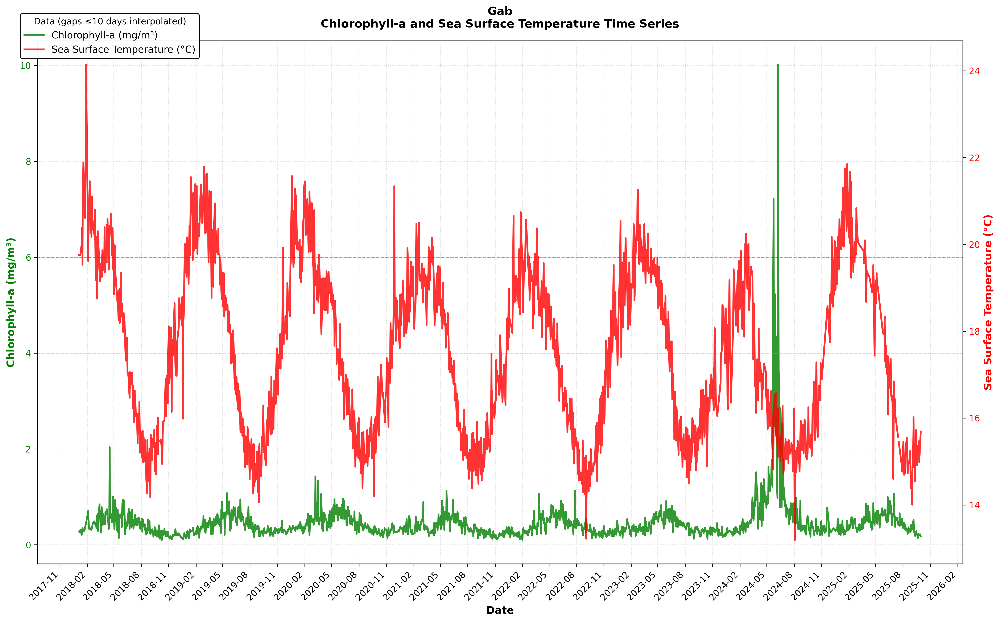
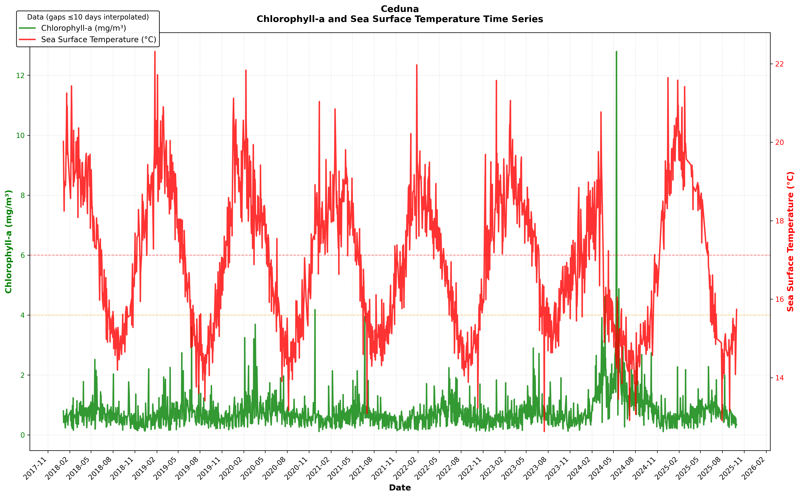
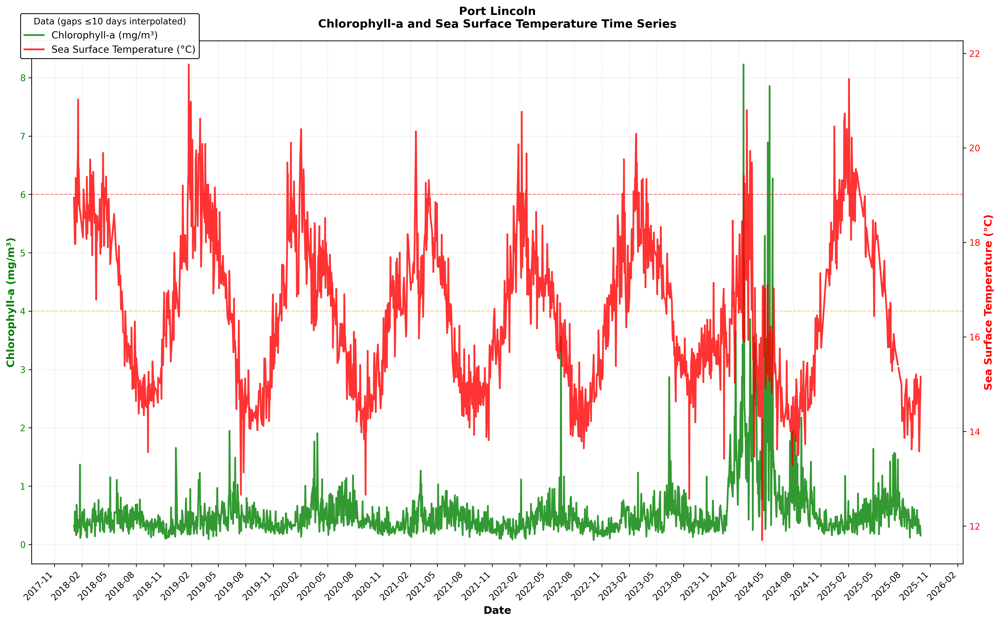
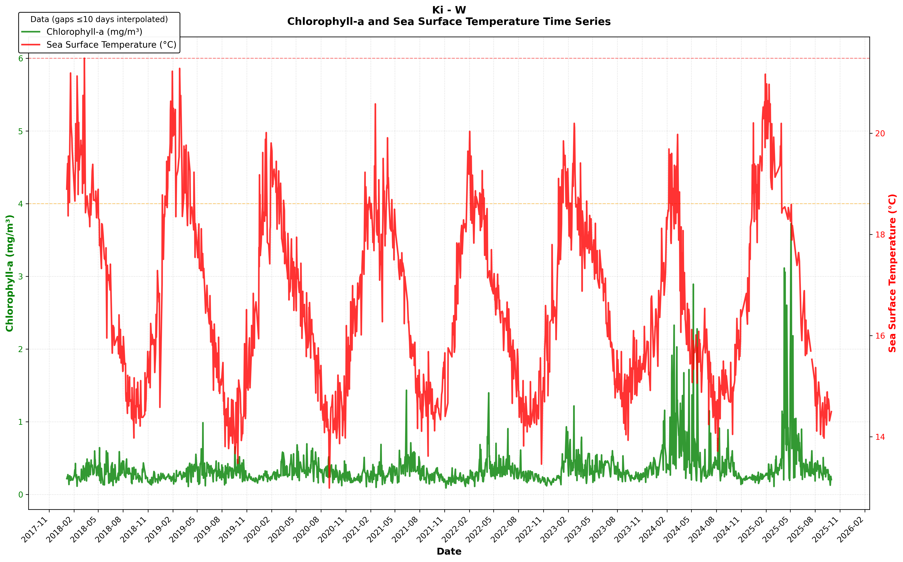
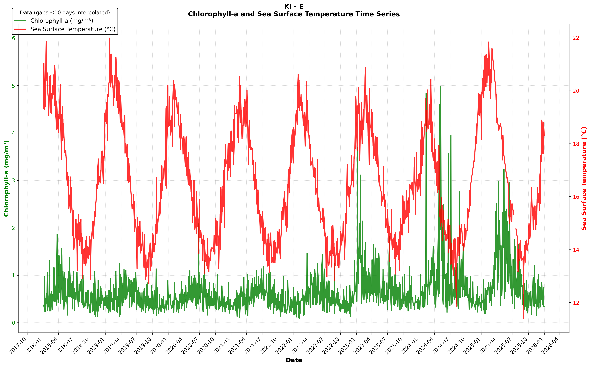
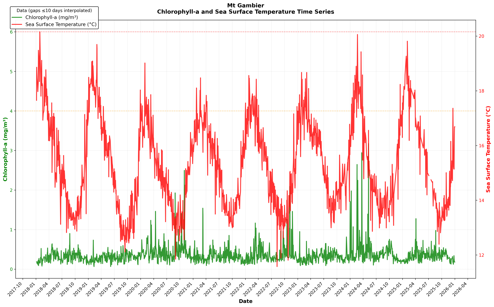
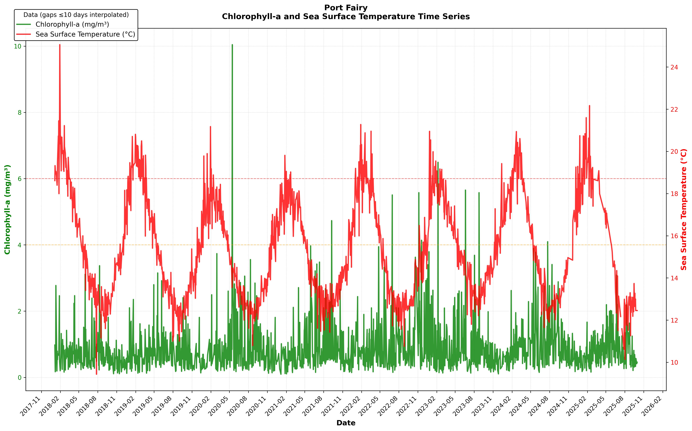

## South Australian algal bloom investigation with VIIRS SST and Chlr-A data












### Yearly mean values
```
| Group      |      GAB |   Ceduna |   Port Lincoln |   Spencer Gulf N |   Spencer Gulf S |   SVG - NW |   SVG - NE |   SVG - SW |   SVG - SE |   KI - W |   KI - E |   Victor Harbor |   Victor Harbour-Mt Gambier |   Mt Gambier |   Port Fairy |
|:-----------|---------:|---------:|---------------:|-----------------:|-----------------:|-----------:|-----------:|-----------:|-----------:|---------:|---------:|----------------:|----------------------------:|-------------:|-------------:|
| 2012       | 0.395075 | 0.608612 |       0.392165 |          2.09321 |         0.501355 |    2.37877 |    4.18012 |   0.711444 |   0.742047 | 0.282815 | 0.540881 |        0.624547 |                    0.467531 |     0.332491 |     0.784586 |
| 2013       | 0.47089  | 0.665381 |       0.396056 |          2.33228 |         0.572121 |    2.75805 |    4.55311 |   0.792129 |   0.87921  | 0.289305 | 0.555602 |        0.499051 |                    0.447544 |     0.315183 |     0.730188 |
| 2014       | 0.359467 | 0.712754 |       0.485392 |          2.25381 |         0.544774 |    2.58515 |    4.72018 |   0.785615 |   0.730013 | 0.333831 | 0.606861 |        0.545184 |                    0.520572 |     0.301768 |     0.653584 |
| 2015       | 0.411298 | 0.628808 |       0.39525  |          2.12494 |         0.525064 |    2.6436  |    4.38201 |   0.733837 |   0.762453 | 0.274865 | 0.483314 |        0.49693  |                    0.421543 |     0.288988 |     0.608774 |
| 2016       | 0.443817 | 0.753491 |       0.518742 |          2.24393 |         0.588852 |    2.54825 |    4.1554  |   0.849325 |   0.94727  | 0.325527 | 0.572719 |        0.665466 |                    0.607691 |     0.350283 |     0.74683  |
| 2017       | 0.42148  | 0.696296 |       0.416969 |          2.15074 |         0.516727 |    2.55451 |    3.80648 |   0.758223 |   0.804488 | 0.294448 | 0.562252 |        0.546706 |                    0.440204 |     0.317932 |     0.765035 |
| 2018       | 0.374212 | 0.584995 |       0.354884 |          1.91313 |         0.492898 |    2.14749 |    3.28013 |   0.712456 |   0.764651 | 0.269927 | 0.522626 |        0.541234 |                    0.387717 |     0.288127 |     0.581171 |
| 2019       | 0.375582 | 0.618444 |       0.409259 |          1.99953 |         0.514244 |    2.25286 |    3.86962 |   0.683958 |   0.703383 | 0.279634 | 0.477494 |        0.571635 |                    0.391544 |     0.277845 |     0.612534 |
| 2020       | 0.427576 | 0.709789 |       0.448786 |          2.03964 |         0.502118 |    2.48055 |    4.08964 |   0.664259 |   0.693749 | 0.297335 | 0.495834 |        0.449234 |                    0.52211  |     0.395027 |     0.695104 |
| 2021       | 0.334956 | 0.550345 |       0.387701 |          1.74465 |         0.478702 |    2.19237 |    3.42195 |   0.614813 |   0.610256 | 0.275859 | 0.483064 |        0.514784 |                    0.43047  |     0.300323 |     0.702936 |
| 2022       | 0.357808 | 0.590323 |       0.356635 |          1.95371 |         0.496317 |    2.24708 |    3.66757 |   0.60951  |   0.656991 | 0.279882 | 0.484602 |        0.604313 |                    0.461897 |     0.340982 |     0.791325 |
| 2023Q1     | 0.321213 | 0.509306 |       0.436162 |          2.04546 |         0.547699 |    2.75922 |    3.33793 |   0.993015 |   0.713174 | 0.413031 | 0.979106 |        0.932143 |                    0.519241 |     0.224514 |     0.71165  |
| 2023Q2     | 0.544997 | 0.816529 |       0.508516 |          2.05897 |         0.716333 |    2.29809 |    3.74676 |   1.03944  |   0.996537 | 0.342779 | 0.727664 |        0.933858 |                    0.474418 |     0.305635 |     0.7549   |
| 2023Q3     | 0.34565  | 0.618361 |       0.422862 |          1.91049 |         0.54331  |    2.20684 |    4.15975 |   0.765795 |   0.79374  | 0.300544 | 0.609091 |        0.777086 |                    0.544357 |     0.348316 |     0.759266 |
| 2023Q4     | 0.266268 | 0.465836 |       0.369869 |          1.73369 |         0.388373 |    2.29916 |    3.16746 |   0.589891 |   0.553691 | 0.280486 | 0.472604 |        0.640535 |                    0.515707 |     0.273065 |     0.480257 |
| 2024Q1     | 0.454326 | 1.28906  |       1.86361  |          2.18012 |         0.678987 |    2.63438 |    3.39618 |   0.724994 |   0.694829 | 0.716583 | 0.786435 |        0.910118 |                    1.55208  |     0.463185 |     0.816965 |
| 2024Q2     | 1.3662   | 1.61362  |       1.20199  |          2.07073 |         0.824375 |    2.3182  |    3.31705 |   0.878533 |   0.797009 | 0.476847 | 0.960647 |        1.22779  |                    0.706783 |     0.391611 |     0.837316 |
| 2024Q3     | 0.483385 | 1.16757  |       0.750769 |          1.80058 |         0.739266 |    1.69659 |    3.89979 |   0.74611  |   0.717173 | 0.410024 | 0.763577 |        0.97648  |                    0.674633 |     0.379422 |     1.05563  |
| 2024Q4     | 0.311394 | 0.577865 |       0.357265 |          1.5184  |         0.421747 |    2.0938  |    3.1447  |   0.562048 |   0.463881 | 0.234204 | 0.476275 |        0.443046 |                    0.422824 |     0.294721 |     0.622021 |
| 2025Q1     | 0.376193 | 0.588731 |       0.395249 |          2.21098 |         0.550462 |    2.69539 |    3.32973 |   0.824022 |   0.692935 | 0.297852 | 0.673126 |        0.490915 |                    0.472143 |     0.271055 |     0.634368 |
| 2025Q2     | 0.586443 | 0.789978 |       0.562833 |          2.18851 |         1.02882  |    4.36114 |    4.38811 |   2.59219  |   1.40029  | 0.656925 | 1.32357  |        1.10243  |                    0.566423 |     0.367223 |     0.921352 |
| 2025Q3     | 0.343732 | 0.623273 |       0.457752 |          2.84799 |         0.654595 |   13.2696  |   11.8667  |   2.27952  |   3.32532  | 0.319275 | 0.649195 |        0.566067 |                    0.419024 |     0.343666 |     0.627906 |
| Grand Mean | 0.416274 | 0.699686 |       0.485234 |          2.04869 |         0.568657 |    2.6396  |    3.98293 |   0.827182 |   0.801489 | 0.332673 | 0.619703 |        0.653173 |                    0.515636 |     0.322037 |     0.712598 |
```

## VIIRS Pixel Coverage Summary
```

GAB {'lat_km': 100.18799999999983, 'lon_km': 236.14039282935244, 'area_km2': 23658.43367678712, 'expected_pixels': 1478.652104799195}
Ceduna {'lat_km': 166.98, 'lon_km': 177.6865073980579, 'area_km2': 29670.093005327704, 'expected_pixels': 1854.3808128329815}
Port Lincoln {'lat_km': 178.11200000000014, 'lon_km': 128.59228847967626, 'area_km2': 22903.829685692115, 'expected_pixels': 1431.4893553557572}
Spencer Gulf N {'lat_km': 155.84799999999984, 'lon_km': 185.8705282769648, 'area_km2': 28967.55009090838, 'expected_pixels': 1810.4718806817737}
Spencer Gulf S {'lat_km': 144.71599999999967, 'lon_km': 155.49175312392578, 'area_km2': 22502.144545081992, 'expected_pixels': 1406.3840340676245}
SVG - NW {'lat_km': 77.92399999999952, 'lon_km': 38.55462068911782, 'area_km2': 3004.3302625787987, 'expected_pixels': 187.77064141117492}
SVG - NE {'lat_km': 77.92399999999952, 'lon_km': 44.062423644703465, 'area_km2': 3433.520300089852, 'expected_pixels': 214.59501875561574}
SVG - SW {'lat_km': 66.79200000000016, 'lon_km': 40.98439194469068, 'area_km2': 2737.4295067697863, 'expected_pixels': 171.08934417311164}
SVG - SE {'lat_km': 66.79200000000016, 'lon_km': 40.98439194468809, 'area_km2': 2737.4295067696135, 'expected_pixels': 171.08934417310084}
KI - W {'lat_km': 100.18799999999983, 'lon_km': 90.23076422948498, 'area_km2': 9040.039806623625, 'expected_pixels': 565.0024879139766}
KI - E {'lat_km': 100.18799999999983, 'lon_km': 90.23076422948498, 'area_km2': 9040.039806623625, 'expected_pixels': 565.0024879139766}
Victor Harbor {'lat_km': 122.45200000000015, 'lon_km': 135.17525689210305, 'area_km2': 16552.480556951825, 'expected_pixels': 1034.530034809489}
Victor Harbour-Mt Gambier {'lat_km': 211.50799999999984, 'lon_km': 132.56279752558572, 'area_km2': 28038.092179041563, 'expected_pixels': 1752.3807611900977}
Mt Gambier {'lat_km': 111.32, 'lon_km': 174.23988004162143, 'area_km2': 19396.383446233296, 'expected_pixels': 1212.273965389581}
Port Fairy {'lat_km': 111.32, 'lon_km': 174.23988004162143, 'area_km2': 19396.383446233296, 'expected_pixels': 1212.273965389581}

```

## Technical Notes

### VIIRS Sensor Capabilities:

- Operational: 2011-present (Suomi-NPP), 2017-present (NOAA-20)
- Resolution: 750m (superior to MODIS 1000m)
- Calibration: Stable, no orbital drift (unlike aging MODIS)
- Algorithm: Standard NASA OC3 chlorophyll-a retrieval
- Validation: Well-established for coastal waters globally

### Not Benthic Reflectance:

- Upper Spencer Gulf depth: 20-40m (adequate for ocean color sensing)
- Gulf St Vincent North depth: 15-30m (adequate for ocean color sensing)
- VIIRS algorithm corrects for shallow-water reflectance
- 13-year temporal stability rules out bottom-type changes
- Southern regions (similar depths) show low stable values
- Spike events (9.11 mg/m³) impossible from benthic reflectance

### Not Cloud/Atmospheric Artifacts:

- 13-year consistent pattern (thousands of clear-sky observations)
- Multiple independent overpasses (NPP + NOAA-20)
- Standard atmospheric correction applied
- Pattern matches known circulation (counter-clockwise GSV)
- Independent validation: In-situ sampling during 2025 crisis confirmed satellite values

## What is Chlorophyll-a?

Chlorophyll-a is the green pigment found in all photosynthetic algae
and plants. In ocean water, measuring chlorophyll-a tells us how much
algae (phytoplankton) is present. It's the standard indicator used
worldwide to monitor algal blooms.

### Understanding the Measurements (mg/m³)

| Chlorophyll-a Level | Interpretation                  | Water Quality |
|---------------------|---------------------------------|---------------|
| 0.1 - 1.0 mg/m³     | Normal oceanic levels           | 🟢 Healthy    |
| 1.0 - 2.0 mg/m³     | Slightly elevated               | 🟡 Acceptable |
| 2.0 - 5.0 mg/m³     | Moderate bloom conditions       | 🟠 Concerning |
| 5.0 - 10.0 mg/m³    | Severe bloom                    | 🔴 Harmful    |
| > 10.0 mg/m³        | Extreme bloom / toxic potential | 🔴 Crisis     |

### What Causes High Chlorophyll?

Algae need nutrients (primarily nitrogen and phosphorus) to grow. Excessive nutrients from:
- Wastewater discharge
- Agricultural fertilizer runoff
- Industrial waste
- Urban stormwater
- Waste management facilities

### Nitrogen Isotope Fingerprinting

- Sample seagrass/algae tissue from north-south transects
- δ15N signatures differentiate: organic waste (+8 to +20‰), treated sewage (+15 to +22‰), natural marine (+3 to +7‰)
- Definitive source apportionment
- For details, see: https://pubmed.ncbi.nlm.nih.gov/23602260/

## GAB as an Early Warning System for Coastal Algal Blooms

The Great Australian Bight (GAB) serves as an ideal sentinel station
for detecting large-scale algal bloom events along the South
Australian coast. Unlike eastern coastal regions that experience
frequent blooms driven by complex interactions between land-based
nutrient runoff and seasonal upwelling, GAB maintains a
characteristically low and stable chlorophyll-a concentration (~0.4
mg/m³). This oligotrophic baseline, combined with GAB's western
geographic position and isolation from terrestrial nutrient sources,
creates a monitoring location with exceptionally high signal-to-noise
ratio. When GAB experiences significant chlorophyll elevation, it
reliably indicates a major oceanographic forcing event rather than
localized phenomena.

```
┌─────────────────────────────────────────────────────────────────────────┐
│                    WHY GAB WORKS AS A SENTINEL                          │
├─────────────────────────────────────────────────────────────────────────┤
│                                                                         │
│  📍 LOCATION              🔬 CHARACTERISTICS         📊 SIGNAL QUALITY  │
│  • Western position       • Low baseline (~0.4)      • High SNR         │
│  • Upstream of coast      • Stable 2017-2023         • Rare false +     │
│  • Deep water access      • No land runoff           • Clear threshold  │
│  • First to see events    • Simple ecosystem         • Easy interpret   │
│                                                                         │
├─────────────────────────────────────────────────────────────────────────┤
│                         ALERT FRAMEWORK                                 │
├──────────────────┬──────────────────────┬───────────────────────────────┤
│   TIER 1: Watch  │   TIER 2: Warning    │   TIER 3: Major Event         │
├──────────────────┼──────────────────────┼───────────────────────────────┤
│  > 0.9 mg/m³     │   > 2.0 mg/m³        │   > 4.0 mg/m³                 │
│  (2x baseline)   │   (5x baseline)      │   (10x baseline)              │
│                  │                      │                               │
│  ⚠️  Monitor     │   🚨 Surveillance    │   🔴 Full Response            │
│  • Check weekly  │   • Model trajectory │   • Coastwide event likely    │
│  • Review winds  │   • Prep advisories  │   • 6-9 month lead time       │
│  • Track SST     │   • Alert stakehldrs │   • Issue public warnings     │
└──────────────────┴──────────────────────┴───────────────────────────────┘

                        2024 CASE EXAMPLE
        ┌───────────────────────────────────────────────────┐
        │  June 8, 2024: GAB = 10.02 mg/m³ (23x baseline!)  │
        │                        ↓                          │
        │         [TIER 3 THRESHOLD EXCEEDED]               │
        │            ⚠️ Signal unmonitored                  │
        │                        ↓                          │
        │     Bloom develops through winter/spring 2024     │
        │                        ↓                          │
        │      March 2025: Surfers report on Facebook       │
        │         (~9 months after GAB spike)               │
        │                        ↓                          │
        │         Public awareness & investigation          │
        └───────────────────────────────────────────────────┘

KEY ADVANTAGES                        OPERATIONAL BENEFITS
━━━━━━━━━━━━━━━━━━━━━━━━━━━━━━━━━━━━━━━━━━━━━━━━━━━━━━━━━━━━━━━
✓ Single station monitoring           ✓ Simple, actionable system
✓ Clear interpretation                ✓ No complex models needed
✓ Distinguishes event types           ✓ Months of warning time
✓ Low false alarm rate                ✓ Cost-effective implementation

        GAB QUIET + Spencer Gulf HIGH  →  Land runoff event
        GAB HIGH + Coastal regions HIGH →  Ocean-driven (2024 type)
```

---
## Ocean thermal energy analysis
- Mixed layer depth: 10.0m
- Grid cell area: 0.5625 km²
- Baseline temperature: 15.0°C

### GAB:
  - SST: 17.48°C  |  Trend: -0.1425°C/yr (p=0.0000)
  - Heating DD/yr: 558.4  |  Cooling DD/yr: 5.7
  - MARINE HEAT WAVES DETECTED: 9 events (88 total days) 90th percentile threshold: 20.01°C
      - 2018-01-17 to 2018-01-28: 7 days, mean 21.58°C (+1.57°C), max 24.14°C (+4.14°C)
      - 2018-02-05 to 2018-02-27: 12 days, mean 20.66°C (+0.65°C), max 21.45°C (+1.45°C)
      - 2018-04-16 to 2018-04-21: 5 days, mean 20.37°C (+0.37°C), max 20.71°C (+0.70°C)
      - 2019-02-07 to 2019-03-13: 21 days, mean 20.85°C (+0.85°C), max 21.79°C (+1.79°C)
      - 2019-03-16 to 2019-03-21: 5 days, mean 20.39°C (+0.38°C), max 21.24°C (+1.23°C)
      - 2020-01-26 to 2020-02-10: 10 days, mean 20.80°C (+0.80°C), max 21.45°C (+1.45°C)
      - 2023-02-18 to 2023-02-25: 7 days, mean 20.65°C (+0.65°C), max 21.26°C (+1.26°C)
      - 2025-01-09 to 2025-01-14: 5 days, mean 20.67°C (+0.66°C), max 21.30°C (+1.30°C)
      - 2025-01-16 to 2025-02-07: 16 days, mean 20.84°C (+0.84°C), max 21.85°C (+1.85°C)

### Ceduna:
  - SST: 16.97°C  |  Trend: -0.1126°C/yr (p=0.0000)
  - Heating DD/yr: 449.9  |  Cooling DD/yr: 16.4
  - MARINE HEAT WAVES DETECTED: 10 events (89 total days) 90th percentile threshold: 19.29°C
      - 2018-01-18 to 2018-01-25: 6 days, mean 20.32°C (+1.03°C), max 21.25°C (+1.96°C)
      - 2018-02-06 to 2018-02-14: 5 days, mean 20.29°C (+1.00°C), max 21.43°C (+2.14°C)
      - 2018-04-19 to 2018-04-24: 5 days, mean 19.58°C (+0.29°C), max 19.65°C (+0.36°C)
      - 2019-01-22 to 2019-02-04: 11 days, mean 20.26°C (+0.97°C), max 22.31°C (+3.02°C)
      - 2019-02-23 to 2019-03-05: 7 days, mean 20.21°C (+0.92°C), max 20.90°C (+1.61°C)
      - 2019-12-28 to 2020-01-03: 5 days, mean 20.17°C (+0.88°C), max 20.58°C (+1.29°C)
      - 2020-01-27 to 2020-02-12: 11 days, mean 20.13°C (+0.84°C), max 21.84°C (+2.55°C)
      - 2023-02-20 to 2023-02-25: 6 days, mean 20.47°C (+1.18°C), max 21.06°C (+1.77°C)
      - 2025-01-07 to 2025-02-13: 27 days, mean 20.11°C (+0.82°C), max 21.58°C (+2.29°C)
      - 2025-02-24 to 2025-03-23: 6 days, mean 20.04°C (+0.75°C), max 21.42°C (+2.13°C)

### Port Lincoln:
  - SST: 16.49°C  |  Trend: -0.1123°C/yr (p=0.0000)
  - Heating DD/yr: 335.1  |  Cooling DD/yr: 22.7
  - MARINE HEAT WAVES DETECTED: 8 events (58 total days) 90th percentile threshold: 18.69°C
      - 2018-01-16 to 2018-01-21: 5 days, mean 19.72°C (+1.03°C), max 21.02°C (+2.34°C)
      - 2018-04-08 to 2018-04-12: 5 days, mean 19.25°C (+0.56°C), max 19.90°C (+1.21°C)
      - 2018-04-17 to 2018-04-24: 7 days, mean 19.00°C (+0.31°C), max 19.40°C (+0.71°C)
      - 2019-01-19 to 2019-01-30: 9 days, mean 19.87°C (+1.18°C), max 21.77°C (+3.08°C)
      - 2019-02-23 to 2019-03-02: 6 days, mean 19.75°C (+1.06°C), max 20.62°C (+1.93°C)
      - 2021-04-01 to 2021-04-07: 5 days, mean 19.02°C (+0.33°C), max 19.32°C (+0.63°C)
      - 2023-02-20 to 2023-02-26: 6 days, mean 19.56°C (+0.87°C), max 20.30°C (+1.61°C)
      - 2025-01-12 to 2025-02-03: 15 days, mean 19.71°C (+1.02°C), max 21.46°C (+2.77°C)

### Spencer Gulf N:
  - SST: 17.69°C  |  Trend: -0.0488°C/yr (p=0.2301)
  - Heating DD/yr: 689.2  |  Cooling DD/yr: 115.5
  - MARINE HEAT WAVES DETECTED: 11 events (84 total days) 90th percentile threshold: 22.62°C
      - 2018-01-19 to 2018-01-26: 5 days, mean 24.01°C (+1.39°C), max 24.60°C (+1.98°C)
      - 2018-02-05 to 2018-02-28: 11 days, mean 23.30°C (+0.68°C), max 25.58°C (+2.96°C)
      - 2019-01-14 to 2019-01-30: 7 days, mean 23.58°C (+0.96°C), max 24.52°C (+1.90°C)
      - 2019-02-02 to 2019-02-09: 6 days, mean 23.60°C (+0.98°C), max 24.33°C (+1.71°C)
      - 2019-02-24 to 2019-03-03: 7 days, mean 23.85°C (+1.23°C), max 24.82°C (+2.20°C)
      - 2019-03-07 to 2019-03-14: 5 days, mean 22.98°C (+0.36°C), max 23.19°C (+0.57°C)
      - 2022-01-26 to 2022-02-02: 6 days, mean 23.71°C (+1.09°C), max 24.32°C (+1.70°C)
      - 2023-01-12 to 2023-01-20: 6 days, mean 23.13°C (+0.51°C), max 24.05°C (+1.43°C)
      - 2024-02-18 to 2024-03-03: 10 days, mean 23.39°C (+0.77°C), max 23.93°C (+1.31°C)
      - 2025-01-10 to 2025-01-29: 13 days, mean 23.57°C (+0.95°C), max 24.22°C (+1.60°C)
      - 2025-02-06 to 2025-02-19: 8 days, mean 23.68°C (+1.06°C), max 24.76°C (+2.14°C)

### Spencer Gulf S:
  - SST: 16.97°C  |  Trend: -0.1058°C/yr (p=0.0002)
  - Heating DD/yr: 520.1  |  Cooling DD/yr: 75.4
  - MARINE HEAT WAVES DETECTED: 9 events (77 total days) 90th percentile threshold: 20.65°C
      - 2018-02-05 to 2018-02-15: 7 days, mean 21.36°C (+0.71°C), max 21.82°C (+1.17°C)
      - 2018-02-17 to 2018-03-04: 8 days, mean 21.18°C (+0.53°C), max 21.50°C (+0.84°C)
      - 2018-03-06 to 2018-03-19: 9 days, mean 21.19°C (+0.54°C), max 22.00°C (+1.35°C)
      - 2019-01-28 to 2019-02-12: 11 days, mean 21.54°C (+0.89°C), max 22.55°C (+1.90°C)
      - 2019-02-21 to 2019-03-05: 10 days, mean 21.86°C (+1.21°C), max 23.18°C (+2.53°C)
      - 2020-02-10 to 2020-02-18: 5 days, mean 20.92°C (+0.27°C), max 21.19°C (+0.54°C)
      - 2025-01-18 to 2025-02-03: 12 days, mean 21.76°C (+1.10°C), max 22.79°C (+2.14°C)
      - 2025-02-06 to 2025-02-19: 10 days, mean 21.82°C (+1.17°C), max 23.26°C (+2.61°C)
      - 2025-02-24 to 2025-03-23: 5 days, mean 21.52°C (+0.86°C), max 22.08°C (+1.43°C)

### SVG - NW:
  - SST: 17.31°C  |  Trend: -0.0980°C/yr (p=0.0470)
  - Heating DD/yr: 410.6  |  Cooling DD/yr: 92.0
  - MARINE HEAT WAVES DETECTED: 7 events (55 total days) 90th percentile threshold: 22.11°C
      - 2018-02-05 to 2018-03-06: 7 days, mean 22.72°C (+0.60°C), max 24.52°C (+2.41°C)
      - 2019-01-14 to 2019-02-10: 14 days, mean 23.51°C (+1.40°C), max 26.59°C (+4.48°C)
      - 2019-02-24 to 2019-03-03: 7 days, mean 23.52°C (+1.41°C), max 24.30°C (+2.19°C)
      - 2019-12-29 to 2020-01-14: 6 days, mean 22.78°C (+0.66°C), max 23.92°C (+1.81°C)
      - 2024-02-18 to 2024-02-27: 5 days, mean 22.69°C (+0.58°C), max 23.47°C (+1.36°C)
      - 2025-01-10 to 2025-01-27: 9 days, mean 23.29°C (+1.18°C), max 24.04°C (+1.93°C)
      - 2025-02-02 to 2025-02-12: 7 days, mean 23.28°C (+1.17°C), max 23.99°C (+1.88°C)

### SVG - NE:
  - SST: 17.48°C  |  Trend: -0.0470°C/yr (p=0.3724)
  - Heating DD/yr: 413.4  |  Cooling DD/yr: 87.4
  - MARINE HEAT WAVES DETECTED: 5 events (40 total days) 90th percentile threshold: 22.35°C
      - 2019-01-14 to 2019-02-07: 12 days, mean 23.64°C (+1.29°C), max 24.63°C (+2.28°C)
      - 2019-02-25 to 2019-03-03: 5 days, mean 24.10°C (+1.75°C), max 24.88°C (+2.53°C)
      - 2023-01-09 to 2023-01-17: 5 days, mean 23.06°C (+0.71°C), max 23.55°C (+1.20°C)
      - 2025-01-10 to 2025-01-29: 9 days, mean 23.37°C (+1.02°C), max 24.12°C (+1.77°C)
      - 2025-02-02 to 2025-02-18: 9 days, mean 23.26°C (+0.91°C), max 24.36°C (+2.01°C)

### SVG - SW:
  - SST: 16.90°C  |  Trend: -0.1097°C/yr (p=0.0038)
  - Heating DD/yr: 387.8  |  Cooling DD/yr: 85.6
  - MARINE HEAT WAVES DETECTED: 4 events (71 total days) 90th percentile threshold: 20.94°C
      - 2018-02-05 to 2018-03-16: 19 days, mean 21.42°C (+0.48°C), max 22.42°C (+1.48°C)
      - 2019-01-22 to 2019-02-12: 13 days, mean 21.65°C (+0.70°C), max 22.13°C (+1.19°C)
      - 2019-02-23 to 2019-03-03: 8 days, mean 22.18°C (+1.24°C), max 22.76°C (+1.82°C)
      - 2025-01-10 to 2025-03-26: 31 days, mean 21.81°C (+0.87°C), max 23.20°C (+2.26°C)

### SVG - SE:
  - SST: 17.30°C  |  Trend: -0.1035°C/yr (p=0.0154)
  - Heating DD/yr: 424.8  |  Cooling DD/yr: 79.7
  - MARINE HEAT WAVES DETECTED: 5 events (62 total days) 90th percentile threshold: 21.54°C
      - 2018-01-17 to 2018-01-25: 5 days, mean 22.41°C (+0.86°C), max 23.77°C (+2.23°C)
      - 2018-02-05 to 2018-03-06: 15 days, mean 22.09°C (+0.55°C), max 23.66°C (+2.12°C)
      - 2019-01-22 to 2019-02-12: 12 days, mean 22.35°C (+0.81°C), max 22.77°C (+1.23°C)
      - 2019-02-23 to 2019-03-09: 10 days, mean 22.58°C (+1.04°C), max 24.04°C (+2.49°C)
      - 2025-01-18 to 2025-02-22: 20 days, mean 22.49°C (+0.95°C), max 23.64°C (+2.10°C)

### KI - W:
  - SST: 16.63°C  |  Trend: -0.0959°C/yr (p=0.0000)
  - Heating DD/yr: 317.0  |  Cooling DD/yr: 20.2
  - MARINE HEAT WAVES DETECTED: 8 events (77 total days) 90th percentile threshold: 19.18°C
      - 2018-01-16 to 2018-01-25: 5 days, mean 20.12°C (+0.94°C), max 21.19°C (+2.01°C)
      - 2018-02-06 to 2018-02-15: 5 days, mean 20.08°C (+0.90°C), max 21.13°C (+1.95°C)
      - 2018-02-17 to 2018-03-03: 7 days, mean 19.70°C (+0.51°C), max 20.21°C (+1.03°C)
      - 2019-01-14 to 2019-02-10: 16 days, mean 20.02°C (+0.84°C), max 21.23°C (+2.05°C)
      - 2019-02-19 to 2019-03-02: 9 days, mean 20.08°C (+0.90°C), max 21.28°C (+2.10°C)
      - 2022-01-26 to 2022-02-02: 6 days, mean 19.58°C (+0.40°C), max 20.04°C (+0.86°C)
      - 2025-01-10 to 2025-02-17: 23 days, mean 20.19°C (+1.01°C), max 21.17°C (+1.99°C)
      - 2025-03-24 to 2025-03-29: 6 days, mean 19.66°C (+0.48°C), max 20.20°C (+1.01°C)

### KI - E:
  - SST: 16.51°C  |  Trend: -0.1005°C/yr (p=0.0001)
  - Heating DD/yr: 328.7  |  Cooling DD/yr: 54.3
  - MARINE HEAT WAVES DETECTED: 8 events (96 total days) 90th percentile threshold: 19.69°C
      - 2018-01-16 to 2018-01-25: 6 days, mean 20.79°C (+1.10°C), max 21.87°C (+2.18°C)
      - 2018-02-06 to 2018-02-15: 5 days, mean 20.28°C (+0.59°C), max 20.58°C (+0.89°C)
      - 2018-02-26 to 2018-03-06: 7 days, mean 20.12°C (+0.43°C), max 20.60°C (+0.91°C)
      - 2019-01-14 to 2019-02-13: 19 days, mean 20.54°C (+0.85°C), max 21.99°C (+2.30°C)
      - 2019-02-15 to 2019-03-07: 12 days, mean 20.45°C (+0.76°C), max 21.27°C (+1.58°C)
      - 2019-03-17 to 2019-03-23: 5 days, mean 20.06°C (+0.37°C), max 20.40°C (+0.71°C)
      - 2023-02-20 to 2023-02-26: 5 days, mean 20.31°C (+0.62°C), max 20.89°C (+1.20°C)
      - 2025-01-05 to 2025-03-25: 37 days, mean 20.61°C (+0.91°C), max 21.84°C (+2.15°C)

### Victor Harbor:
  - SST: 15.95°C  |  Trend: -0.1173°C/yr (p=0.0000)
  - Heating DD/yr: 299.1  |  Cooling DD/yr: 105.5
  - MARINE HEAT WAVES DETECTED: 8 events (76 total days) 90th percentile threshold: 18.98°C
      - 2018-01-11 to 2018-01-22: 9 days, mean 19.78°C (+0.80°C), max 21.77°C (+2.79°C)
      - 2019-01-20 to 2019-02-03: 11 days, mean 20.00°C (+1.02°C), max 20.69°C (+1.71°C)
      - 2019-02-24 to 2019-03-04: 8 days, mean 20.34°C (+1.35°C), max 21.64°C (+2.66°C)
      - 2020-02-08 to 2020-02-18: 5 days, mean 19.45°C (+0.47°C), max 19.65°C (+0.67°C)
      - 2023-02-19 to 2023-02-27: 7 days, mean 19.89°C (+0.91°C), max 20.74°C (+1.76°C)
      - 2024-12-10 to 2024-12-20: 5 days, mean 19.83°C (+0.85°C), max 20.80°C (+1.81°C)
      - 2024-12-31 to 2025-02-08: 25 days, mean 20.02°C (+1.04°C), max 21.18°C (+2.20°C)
      - 2025-02-11 to 2025-02-18: 6 days, mean 20.07°C (+1.08°C), max 20.87°C (+1.88°C)

### Victor Harbour-Mt Gambier:
  - SST: 15.31°C  |  Trend: -0.0673°C/yr (p=0.0001)
  - Heating DD/yr: 176.1  |  Cooling DD/yr: 110.5
  - MARINE HEAT WAVES DETECTED: 6 events (61 total days) 90th percentile threshold: 17.49°C
      - 2018-01-05 to 2018-01-25: 15 days, mean 18.35°C (+0.87°C), max 19.53°C (+2.04°C)
      - 2019-01-29 to 2019-02-04: 6 days, mean 18.25°C (+0.76°C), max 19.10°C (+1.62°C)
      - 2019-02-24 to 2019-03-06: 8 days, mean 18.38°C (+0.89°C), max 18.92°C (+1.43°C)
      - 2021-03-31 to 2021-04-08: 7 days, mean 17.83°C (+0.35°C), max 18.09°C (+0.60°C)
      - 2022-01-25 to 2022-01-29: 5 days, mean 19.13°C (+1.65°C), max 19.86°C (+2.38°C)
      - 2025-01-01 to 2025-02-04: 20 days, mean 18.37°C (+0.88°C), max 20.24°C (+2.75°C)

### Mt Gambier:
  - SST: 15.32°C  |  Trend: -0.0425°C/yr (p=0.0276)
  - Heating DD/yr: 169.3  |  Cooling DD/yr: 107.3
  - MARINE HEAT WAVES DETECTED: 8 events (92 total days) 90th percentile threshold: 17.65°C
      - 2018-01-06 to 2018-02-17: 19 days, mean 18.57°C (+0.92°C), max 20.16°C (+2.50°C)
      - 2018-03-06 to 2018-03-15: 6 days, mean 18.10°C (+0.45°C), max 18.77°C (+1.12°C)
      - 2019-01-10 to 2019-02-19: 21 days, mean 18.38°C (+0.73°C), max 19.09°C (+1.44°C)
      - 2019-02-24 to 2019-03-07: 8 days, mean 18.62°C (+0.97°C), max 19.69°C (+2.04°C)
      - 2024-02-01 to 2024-02-14: 12 days, mean 18.14°C (+0.48°C), max 18.90°C (+1.24°C)
      - 2024-03-01 to 2024-03-11: 6 days, mean 18.08°C (+0.43°C), max 18.33°C (+0.68°C)
      - 2025-01-11 to 2025-02-12: 13 days, mean 18.58°C (+0.92°C), max 19.81°C (+2.16°C)
      - 2025-03-01 to 2025-03-29: 7 days, mean 17.88°C (+0.23°C), max 18.09°C (+0.43°C)

### Port Fairy:
  - SST: 15.45°C  |  Trend: -0.0520°C/yr (p=0.0570)
  - Heating DD/yr: 254.0  |  Cooling DD/yr: 163.2
  - MARINE HEAT WAVES DETECTED: 8 events (71 total days) 90th percentile threshold: 18.83°C
      - 2018-01-06 to 2018-01-11: 5 days, mean 19.11°C (+0.28°C), max 19.32°C (+0.49°C)
      - 2018-01-26 to 2018-03-02: 20 days, mean 20.22°C (+1.39°C), max 25.06°C (+6.23°C)
      - 2019-01-10 to 2019-01-16: 5 days, mean 19.57°C (+0.74°C), max 20.71°C (+1.88°C)
      - 2019-01-20 to 2019-02-14: 15 days, mean 19.92°C (+1.09°C), max 20.81°C (+1.98°C)
      - 2022-01-23 to 2022-01-29: 5 days, mean 19.68°C (+0.86°C), max 21.27°C (+2.44°C)
      - 2024-02-08 to 2024-02-25: 10 days, mean 19.49°C (+0.66°C), max 20.94°C (+2.11°C)
      - 2025-01-31 to 2025-02-07: 5 days, mean 19.75°C (+0.92°C), max 20.63°C (+1.80°C)
      - 2025-02-11 to 2025-02-16: 6 days, mean 19.87°C (+1.04°C), max 22.17°C (+3.34°C)

---

Last updated: Wed 31 Dec 2025 15:38:10 ACDT
