## South Australian algal bloom investigation with VIIRS SST and Chlr-A data
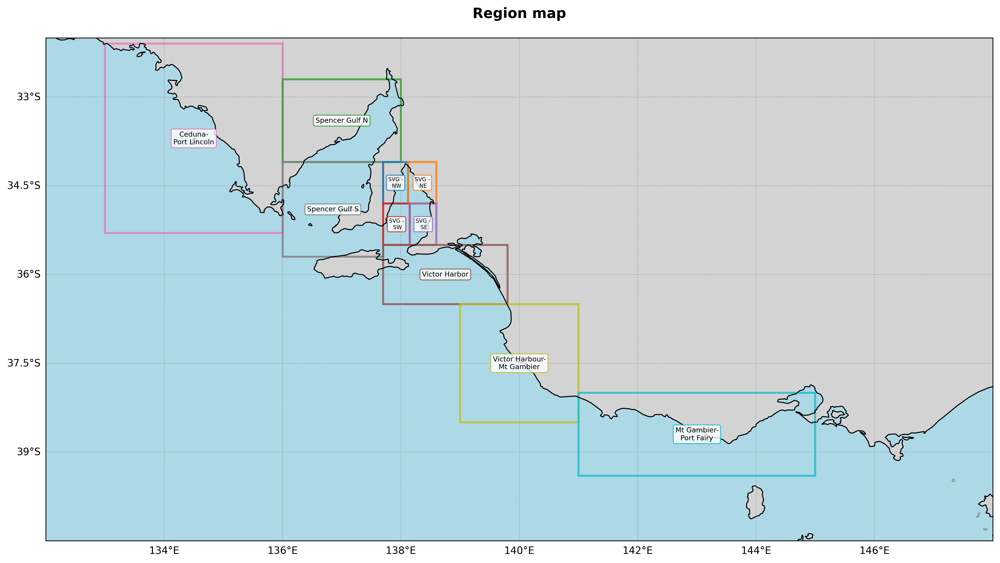
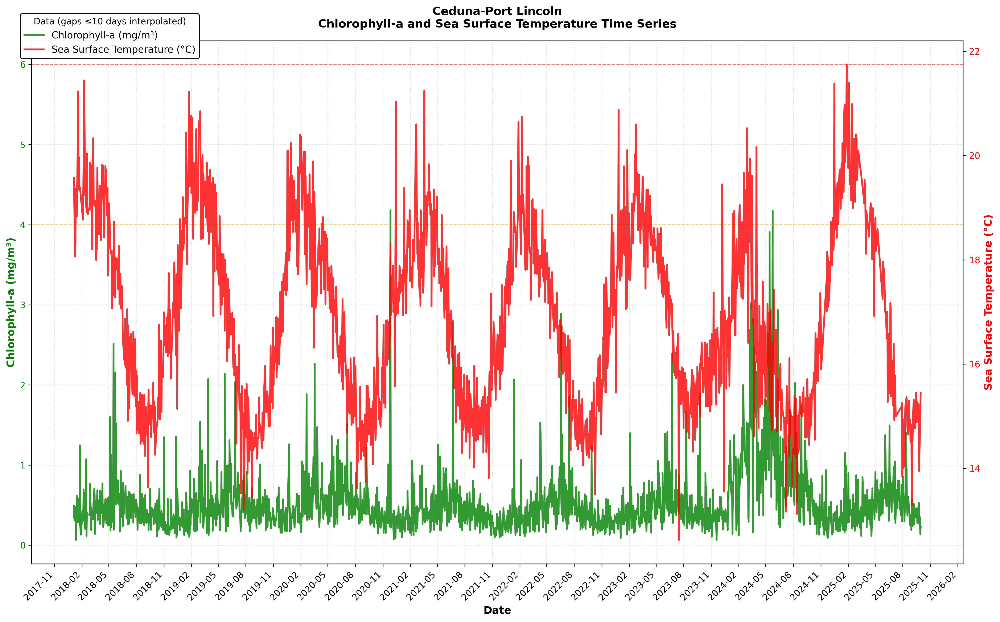
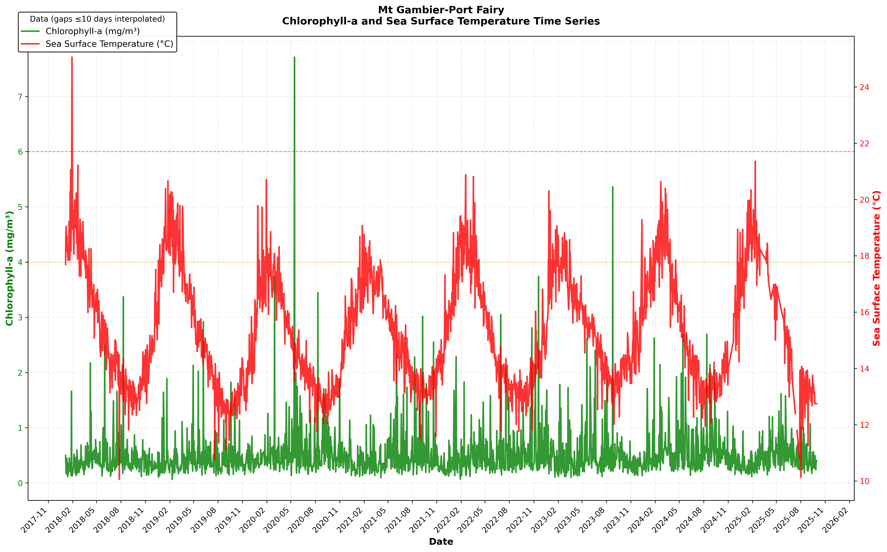
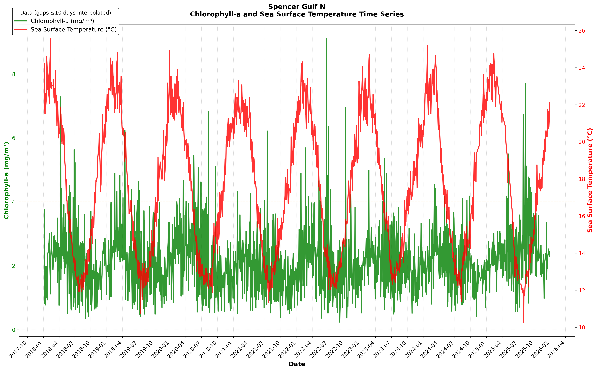
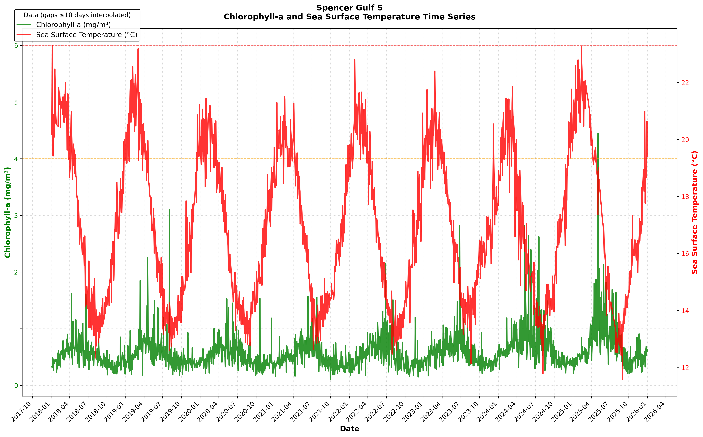
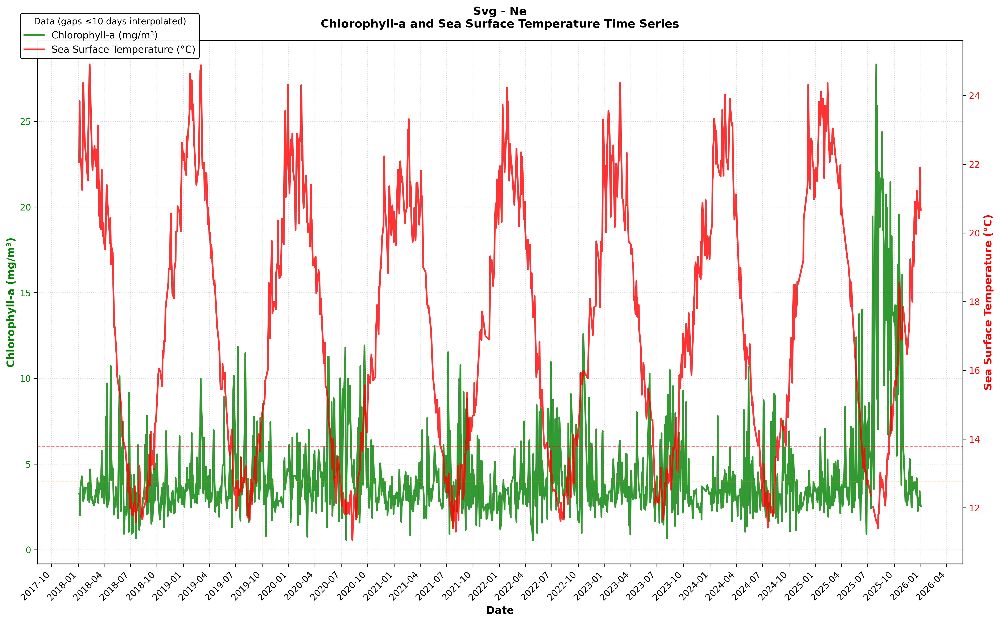
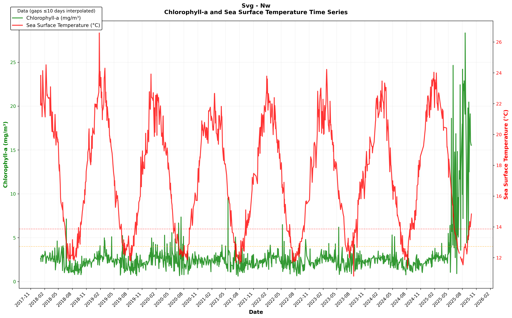
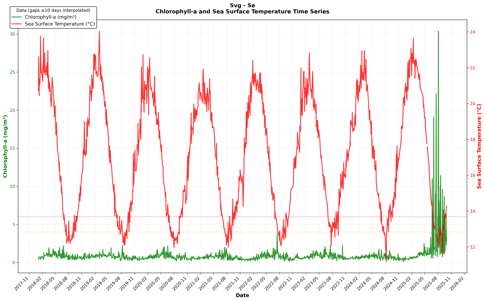
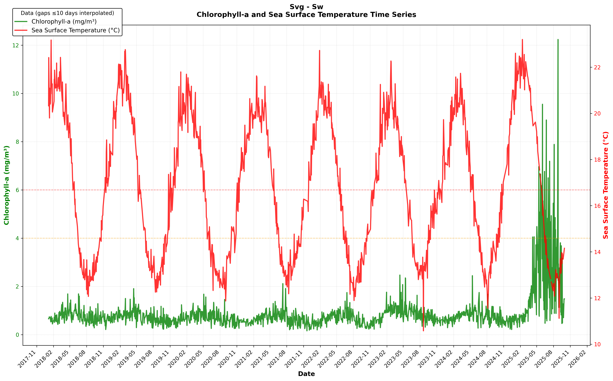
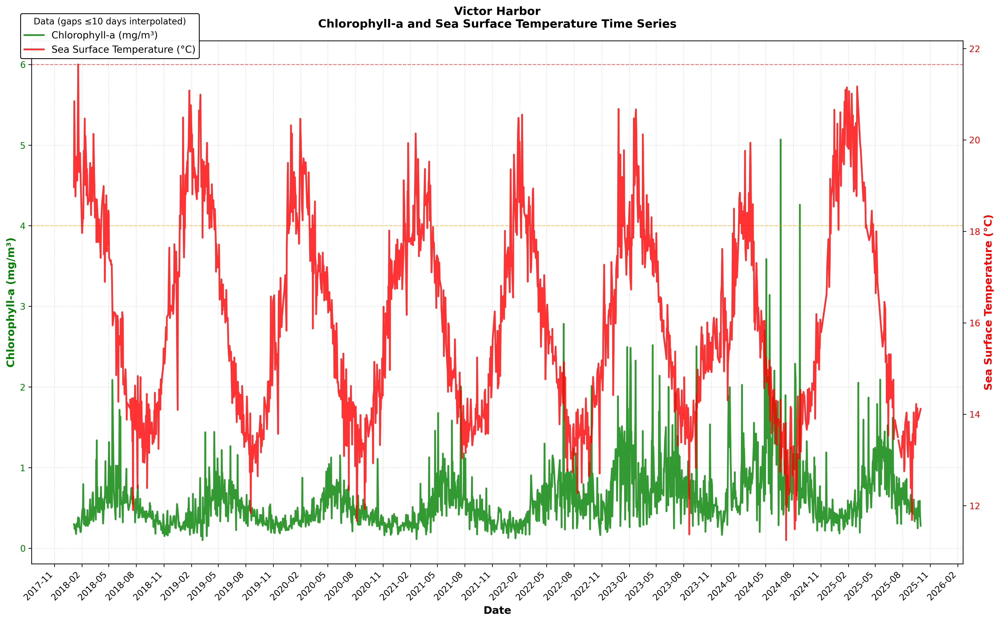
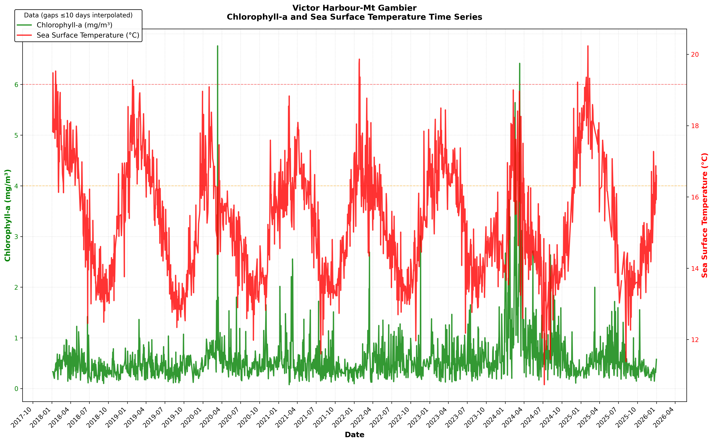
### Yearly mean values
```
| Group      |   Ceduna-Port Lincoln |   Spencer Gulf N |   Spencer Gulf S |   SVG - NW |   SVG - NE |   SVG - SW |   SVG - SE |   Victor Harbor |   Victor Harbour-Mt Gambier |   Mt Gambier-Port Fairy |
|:-----------|----------------------:|-----------------:|-----------------:|-----------:|-----------:|-----------:|-----------:|----------------:|----------------------------:|------------------------:|
| 2012       |              0.412212 |          2.09321 |         0.483247 |    2.37877 |    4.18012 |   0.674106 |   0.741909 |        0.567774 |                    0.402618 |                0.454402 |
| 2013       |              0.413458 |          2.33228 |         0.545301 |    2.75805 |    4.55311 |   0.749652 |   0.879406 |        0.464904 |                    0.372168 |                0.423467 |
| 2014       |              0.459495 |          2.25381 |         0.52829  |    2.58515 |    4.72018 |   0.746754 |   0.731385 |        0.514653 |                    0.441241 |                0.392585 |
| 2015       |              0.41419  |          2.12494 |         0.50171  |    2.6436  |    4.38201 |   0.691598 |   0.761483 |        0.426004 |                    0.356381 |                0.388647 |
| 2016       |              0.485447 |          2.24393 |         0.562895 |    2.54825 |    4.1554  |   0.798038 |   0.95568  |        0.543721 |                    0.452512 |                0.454681 |
| 2017       |              0.444307 |          2.15074 |         0.500674 |    2.55451 |    3.80648 |   0.730264 |   0.802883 |        0.481759 |                    0.378306 |                0.435302 |
| 2018       |              0.392145 |          1.91313 |         0.468226 |    2.14749 |    3.28013 |   0.683995 |   0.76397  |        0.439214 |                    0.328469 |                0.372956 |
| 2019       |              0.420081 |          1.99953 |         0.489593 |    2.25286 |    3.86962 |   0.653821 |   0.70178  |        0.412295 |                    0.34362  |                0.383109 |
| 2020       |              0.476792 |          2.03964 |         0.482304 |    2.48055 |    4.08964 |   0.622249 |   0.688347 |        0.429531 |                    0.439496 |                0.47893  |
| 2021       |              0.371273 |          1.74465 |         0.459645 |    2.19237 |    3.42195 |   0.59019  |   0.610082 |        0.436523 |                    0.358812 |                0.398242 |
| 2022       |              0.392959 |          1.95371 |         0.468495 |    2.24708 |    3.66757 |   0.5875   |   0.667153 |        0.535985 |                    0.377257 |                0.449682 |
| 2023Q1     |              0.36059  |          2.04546 |         0.571687 |    2.75922 |    3.33793 |   0.96337  |   0.715109 |        0.83598  |                    0.40627  |                0.379143 |
| 2023Q2     |              0.527403 |          2.05897 |         0.683543 |    2.29809 |    3.74676 |   0.978674 |   0.993606 |        0.813737 |                    0.38926  |                0.453216 |
| 2023Q3     |              0.447038 |          1.91049 |         0.532458 |    2.20684 |    4.15975 |   0.716588 |   0.796923 |        0.694154 |                    0.434741 |                0.462665 |
| 2023Q4     |              0.334354 |          1.73369 |         0.376311 |    2.29916 |    3.16746 |   0.563034 |   0.554099 |        0.528766 |                    0.449599 |                0.318637 |
| 2024Q1     |              1.04144  |          2.18012 |         0.64083  |    2.63438 |    3.39618 |   0.702712 |   0.694168 |        0.822651 |                    1.16493  |                0.547173 |
| 2024Q2     |              1.07551  |          2.07073 |         0.767248 |    2.3182  |    3.31705 |   0.877313 |   0.797157 |        1.03032  |                    0.595784 |                0.506297 |
| 2024Q3     |              0.733675 |          1.80058 |         0.721043 |    1.69659 |    3.89979 |   0.720629 |   0.730171 |        0.852239 |                    0.522581 |                0.565562 |
| 2024Q4     |              0.325933 |          1.5184  |         0.40674  |    2.0938  |    3.1447  |   0.530464 |   0.46674  |        0.432062 |                    0.338291 |                0.413799 |
| 2025Q1     |              0.386431 |          2.21098 |         0.52543  |    2.69539 |    3.32973 |   0.807508 |   0.694553 |        0.50474  |                    0.366687 |                0.347582 |
| 2025Q2     |              0.535958 |          2.18851 |         1.06953  |    4.36114 |    4.38811 |   2.42194  |   1.40396  |        0.957626 |                    0.467673 |                0.548467 |
| 2025Q3     |              0.453355 |          2.84799 |         0.631461 |   13.2696  |   11.8667  |   2.11777  |   3.3477   |        0.546764 |                    0.359673 |                0.404603 |
| Grand Mean |              0.468629 |          2.04869 |         0.549174 |    2.6396  |    3.98293 |   0.789052 |   0.803351 |        0.57752  |                    0.42399  |                0.430854 |

## VIIRS Pixel Coverage Summary

Ceduna-Port Lincoln {'lat_km': 356.2239999999995, 'lon_km': 277.8393986266959, 'area_km2': 98973.06193639598, 'expected_pixels': 6185.816371024749}
Spencer Gulf N {'lat_km': 155.84799999999984, 'lon_km': 185.8705282769648, 'area_km2': 28967.55009090838, 'expected_pixels': 1810.4718806817737}
Spencer Gulf S {'lat_km': 178.11200000000014, 'lon_km': 155.2088215978551, 'area_km2': 27644.553632437186, 'expected_pixels': 1727.7846020273241}
SVG - NW {'lat_km': 77.92399999999952, 'lon_km': 38.55462068911782, 'area_km2': 3004.3302625787987, 'expected_pixels': 187.77064141117492}
SVG - NE {'lat_km': 77.92399999999952, 'lon_km': 44.062423644703465, 'area_km2': 3433.520300089852, 'expected_pixels': 214.59501875561574}
SVG - SW {'lat_km': 77.9240000000003, 'lon_km': 40.959239837067535, 'area_km2': 3191.7078050636633, 'expected_pixels': 199.48173781647895}
SVG - SE {'lat_km': 77.9240000000003, 'lon_km': 40.95923983706495, 'area_km2': 3191.7078050634614, 'expected_pixels': 199.48173781646634}
Victor Harbor {'lat_km': 111.32, 'lon_km': 189.12552080902225, 'area_km2': 21053.452976460354, 'expected_pixels': 1315.8408110287721}
Victor Harbour-Mt Gambier {'lat_km': 222.64, 'lon_km': 176.6321876824406, 'area_km2': 39325.39026561857, 'expected_pixels': 2457.8368916011605}
Mt Gambier-Port Fairy {'lat_km': 155.84799999999984, 'lon_km': 347.51005177961144, 'area_km2': 54158.74654974883, 'expected_pixels': 3384.921659359302}
```
Last updated: Thu 18 Dec 2025 16:42:12 ACDT
